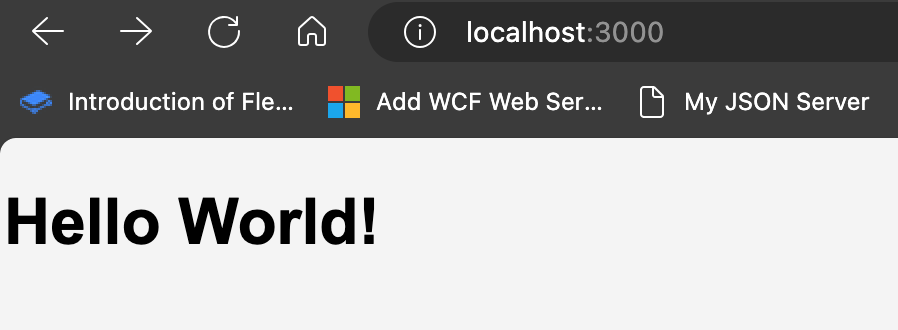
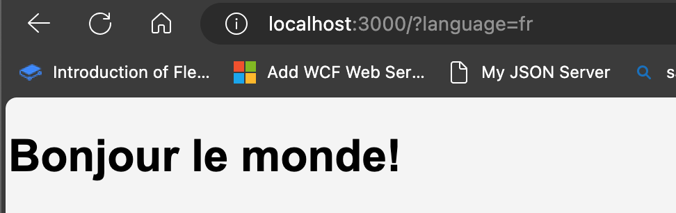

### Hello Query

Maak een nieuw project aan met de naam `hello-query` en installeer de `express` en de `ejs` module.

Maak een nieuwe route aan op de root van de applicatie die een `GET` request afhandelt. De route verwacht een query parameter `language` die een string bevat. Deze string kan een van de volgende waarden bevatten: `en`, `es` of `fr` (Engels, Spaans of Frans). Als de query parameter niet aanwezig is, of een andere waarde bevat, dan wordt de standaard waarde `en` gebruikt.

De route rendert een EJS template die de volgende boodschap toont, afhankelijk van de waarde van de query parameter:
- `en`: "Hello World!"
- `es`: "¡Hola Mundo!"
- `fr`: "Bonjour le monde!"

De template bevat een HTML pagina met een `h1` element waarin de boodschap wordt getoond.

