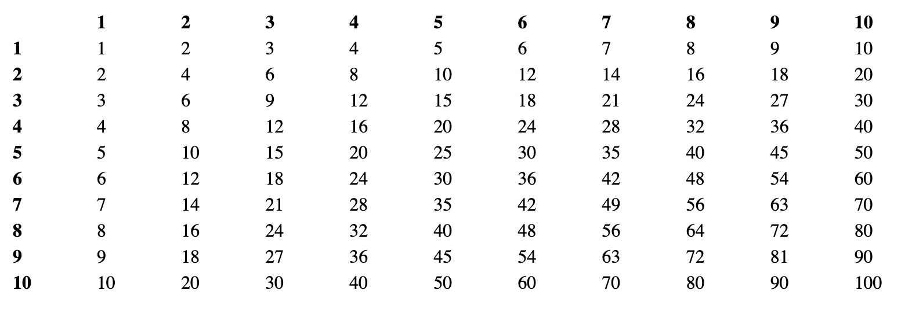

### Maaltafels

Maak een nieuw project **maaltafels** waarin je jouw bronbestanden voor deze oefening kan plaatsen.

Installeer alle nodige libraries voor te werken met express en ejs.

Maak een nieuw bestand `index.ts` aan met de volgende inhoud:

```typescript
import express from "express";
const app = express();

app.set("port",3000);
app.set("view engine", "ejs");

app.get("/", (req:any,res:any) => {
    res.render("maaltafels");
})

app.listen(app.get("port"), () => {
    console.log(`Web application started at http://localhost:${app.get("port")}`)
})
```

Maak nu een nieuwe ejs file aan die de maaltafels van 1 tot en met 10 toont in je browser als je surft naar http://localhost:3000

Je mag geen aanpassingen maken in de `index.ts` file. Het opbouwen van de tabel moet volledig gebeuren in het ejs bestand.

**De output in de browser moet er als volgt uitzien:**

