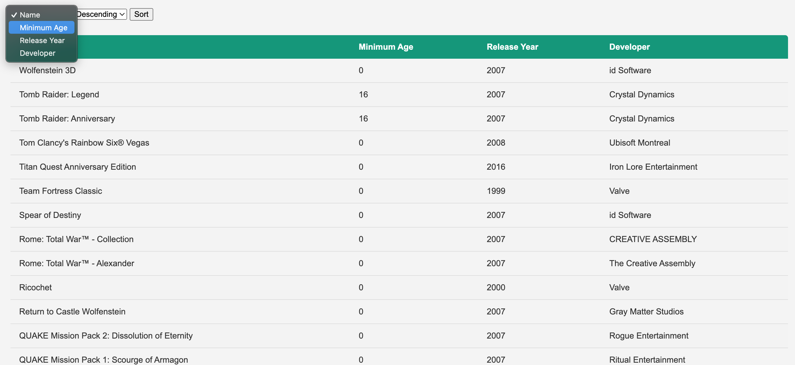

# Steam

#### Steam

In deze oefening bouwen we verder op het volgende starter project: [steam-starter.zip](steam-starter.zip). Deze applicatie is een eenvoudige express applicatie die een route heeft die een lijst van games toont. Bovenaan staat er al formulier om te kunnen sorteren. De sorteer functionaliteit is echter nog niet geïmplementeerd.

We willen dat de gebruiker kan sorteren op Name, Release Year,Minimum Age en developer.



De sorteer functionaliteit moet werken op basis van een GET request en werken met query parameters. Een voorbeeld url kan er als volgt uitzien:

```
http://localhost:3000/?sortField=name&sortDirection=desc
```

Dit zou de games sorteren op naam in dalende volgorde.

#### Uitbreiding

Zorg ervoor dat de gebruiker ook kan sorteren aan de hand van de headers van de tabel. Als de gebruiker op de header klikt, moet de tabel gesorteerd worden op basis van de kolom waarop geklikt is. Als de gebruiker nogmaals klikt op dezelfde header, moet de sorteer volgorde omgekeerd worden.
