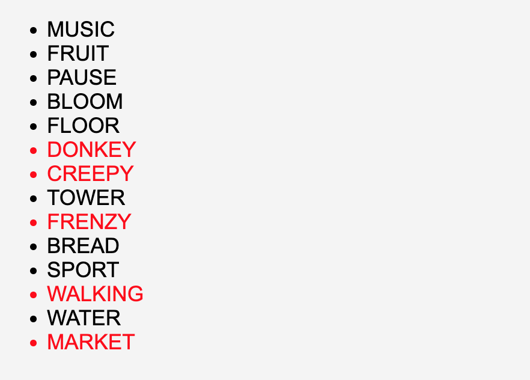
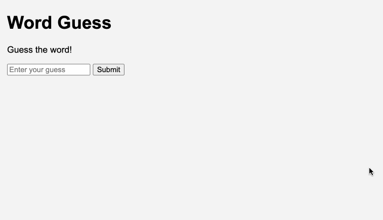

### Word Guess

We beginnen met een bestaande express applicatie. Deze applicatie bevat al een aantal routes en ejs bestanden. De bedoeling is dat je deze applicatie verder uitbreidt met extra functionaliteit. Je kan de starter applicatie hier vinden: [Word Guess](./starter.zip)

#### Includes

- [ ] Maak een `header.ejs` bestand aan dat de header van de pagina bevat (en de bovenkant van de html).
- [ ] Maak een `footer.ejs` bestand aan dat de footer van de pagina bevat (en de onderkant van de html).
- [ ] Pas `index.ejs` aan zodat deze de `header.ejs` en `footer.ejs` bevat.
- [ ] Zorg dat elke ejs pagina vanaf nu de `header.ejs` en `footer.ejs` bevat.

#### Words Module

- [ ] Schrijf een functie `isFiveLetterWord` die controleert of een woord 5 letters lang is. Deze functie moet een boolean teruggeven.
- [ ] Schrijf een functie `getFiveLetterWords` die alle woorden van een meegegeven array teruggeeft die 5 letters lang zijn. Gebruik hiervoor de `filter` functie. Gebruik de `isFiveLetterWord` functie die je hiervoor gemaakt hebt.
- [ ] Schrijf een function `toUpperCase` die een array van woorden omzet naar een array van woorden in hoofdletters.   
- [ ] Schrijf een functie `getRandomWord` die een willekeurig woord teruggeeft van een meegegeven array. 
- [ ] Plaats deze functies in een apart bestand `words.ts` en zorg dat deze kunnen geimporteerd worden. 
- [ ] Vul de `createNewWord` functie aan in de `index.ts` file die de `randomWord` variabele invult met een willekeurig 5 letter woord uit de `words` array.

Voorbeeld:
```
isFiveLetterWord('hello') // true
getFiveLetterWords(['hello', 'world', 'test', 'word']) // ['hello', 'world']
toUpperCase(['hello', 'world', 'test', 'word']) // ['HELLO', 'WORLD', 'TEST', 'WORD']
getRandomWord(['hello', 'world', 'test', 'word']) // 'world'
```

#### Words Route

- [ ] Maak een nieuwe `get` route voor het pad `/words` 
- [ ] Maak gebruik van de `toUpperCase` functie van de vorige opgave om een array aan te maken van woorden in hoofdletters. Gebruik de al reeds aangemaakte array `words`.
- [ ] Geef de array door aan een ejs bestand `words.ejs`.
- [ ] Toon de woorden aan de hand van een for lus en <li> tags.
- [ ] De woorden die geen 5 letters lang zijn geef je een rode kleur.



#### Words Form

- [ ] Maak een nieuwe `get` route voor het pad `/guess`. Zorg ervoor dat het de `guess.ejs` pagina toont.
- [ ] Maak een nieuwe `post` route voor het pad `/guess`. 
- [ ] Gebruik de al voorgemaakte `checkWord` functie om te controleren of het woord correct is. Deze functie geeft dit aan met een kleuren code. Groen als de letter op de juiste plaats staat, geel als de letter wel in het woord zit maar niet op de juiste plaats en grijs als de letter niet in het woord zit. Geef het resultaat door aan de ejs pagina.
- [ ] Toon elke letter van het woord dat je hebt ingegeven in het input veld als een <span>. De background color van de <span> moet de kleur zijn die je hebt meegekregen van de `checkWord` functie. (letter 0 = kleur 0, letter 1 = kleur 1, ...)
- [ ] Als je een woord dat geen 5 letters bevat toon je een foutmelding op de pagina. (Please enter a 5 letter word.)
- [ ] Als alle kleuren groen zijn toon je een succesmelding op de pagina. (Congratulations! You guessed the word.)



#### Restart Game

- [ ] Maak een nieuwe `get` route voor het pad `/restart`.
- [ ] Zorg ervoor dat de `randomWord` variabele opnieuw wordt ingevuld met een willekeurig 5 letter woord uit de `words` array.
- [ ] Stuur de gebruiker terug naar de `/guess` pagina. (redirect)
- [ ] Voeg een link toe aan de `guess.ejs` pagina die de gebruiker naar de `/restart` route stuurt. Toon deze enkel als het spel is afgelopen (bij success message).

