# Beerster

Maak een nieuw express project aan met de naam `beerster`. In dit project gaan we een applicatie bouwen die het mogelijk maakt om in te checken op een locatie en te registreren welk bier je daar drinkt. 

Je kan starten van een aantal starter html bestanden door het [starter project](https://github.com/similonap/webontwikkeling-2024/raw/main/exercises/herhaling/beerster/starter.zip) te downloaden.

## API's

We vertrekken van de volgende APIs

**Beers**

URL: https://raw.githubusercontent.com/slimmii/mock_api/main/beers/beers.json

Dit geeft een lijst van bieren terug. Elk bier heeft een `id`, `name`, `alcoholPercentage`, `description`, `type` en `logo`. 

**Bars**

URL: https://raw.githubusercontent.com/slimmii/mock_api/main/bars/bars.json

Dit geeft een lijst van bars terug. Elke bar heeft een `id`, `name`, `location`, `description`, `images` en `rating`. Images is een array van urls naar afbeeldingen van de bar. Als er een image moet getoond worden in de frontend, kies dan een willekeurige image uit de array tenzij ze allemaal gevraagd worden.

**Checkins**

URL: https://raw.githubusercontent.com/slimmii/mock_api/main/checkins/checkins.json

Dit geeft een lijst van checkins terug. Elke checkin heeft een `id`, `barId`, `beerId`, `name`, `comment`, `date` en `image`. Bij het inlezen moet je de `bar` en `beer` objecten toevoegen aan de checkin. Je kan deze opzoeken via de `barId` en `beerId` in de respectievelijke arrays. In de database zal je dus geen `beerId` en `barId` opslaan, maar wel de volledige objecten.

## Inlezen in de database

Bij het opstarten van de applicatie moet je de data inlezen in de database. Je roept de API's aan via een GET request en slaat de data op in de database.

Je zorgt voor de volgende collecties:
- beers (met de bieren)
- bars (met de bars)
- checkins (met de checkins)
- users (met de gebruikers)

Je zorgt ervoor dat de checkins geen `beerId` en `barId` bevatten, maar wel de volledige objecten.

Ook maak je 2 gebruikers aan in de database. Bv:

```typescript
const initialUsers: User[] = [
    {
        username: "solo",
        fullname: "Han Solo",
        password: "hanshotfirst"
    },
    {
        username: "princess",
        fullname: "Leia Organa",
        password: "obiwan"
    }
];
```

## Login pagina

Maak een login pagina waarop je kan inloggen. Je kan inloggen met de gebruikers die je hebt aangemaakt in de database. Als je inlogt, wordt je doorgestuurd naar de home pagina. Gebruik hiervoor JWT tokens en dus geen sessies. Je mag de username en de fullname van de gebruiker in de token steken. Het wachtwoord mag niet in de token zitten.

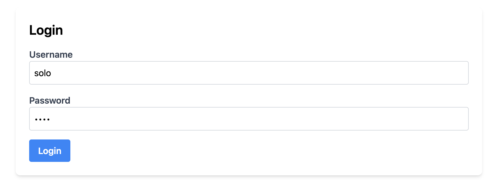

Voorzie een error message als de gebruiker niet bestaat of het wachtwoord fout is. Gebruik hiervoor flash messages in de session.

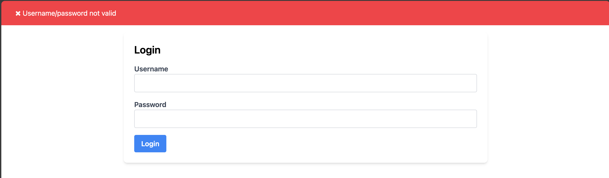

## Home pagina

Het home scherm bestaat uit een aantal verschillende onderdelen. Je kan deze vinden op de `/` route. Je moet ingelogd zijn om deze pagina te kunnen zien.

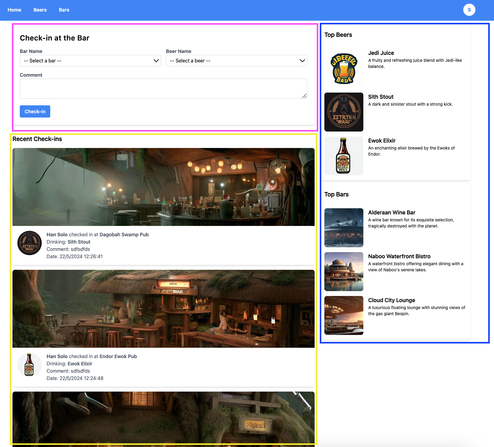

### Recent Check-ins

Is een overzicht van alle check-ins die gedaan zijn. Je toont de naam van de gebruiker, de naam van het bier, de naam van de bar, de datum en een eventuele comment. Bovenaan elke checkin toon je een willkeurige afbeelding van de bar en het logo van het bier.

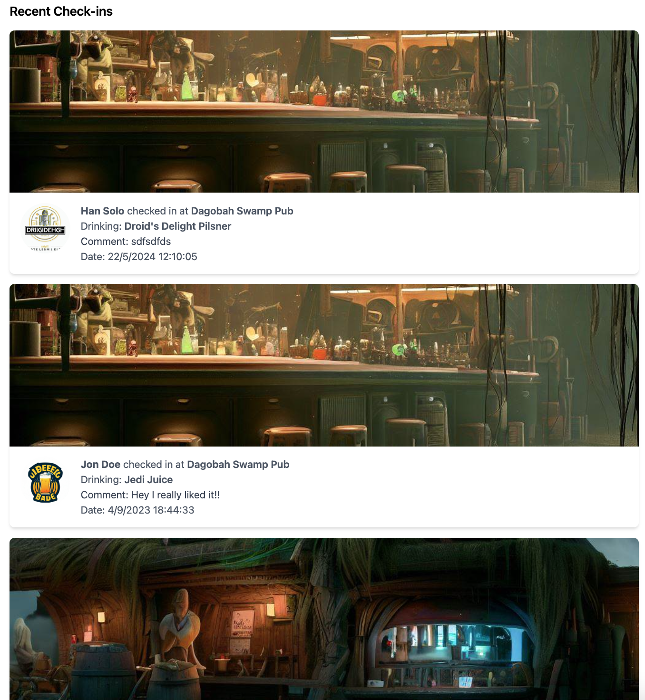

Limiteer het aantal check-ins dat getoond wordt tot 5. Je kan dit overschrijven door een query parameter `limit` mee te geven.

### Check-in formulier

Boven de recent check-ins toon je een formulier waarmee je een nieuwe check-in kan toevoegen. Je kan een bier kiezen uit een dropdown en een bar kiezen uit een andere dropdown. Je kan een comment toevoegen. Als je op submit klikt, wordt de check-in toegevoegd aan de database en zie je deze verschijnen in de recent check-ins. Je krijgt ook een succes message te zien. 

Je mag willeurig een image kiezen van de bar voor de image van de check-in.

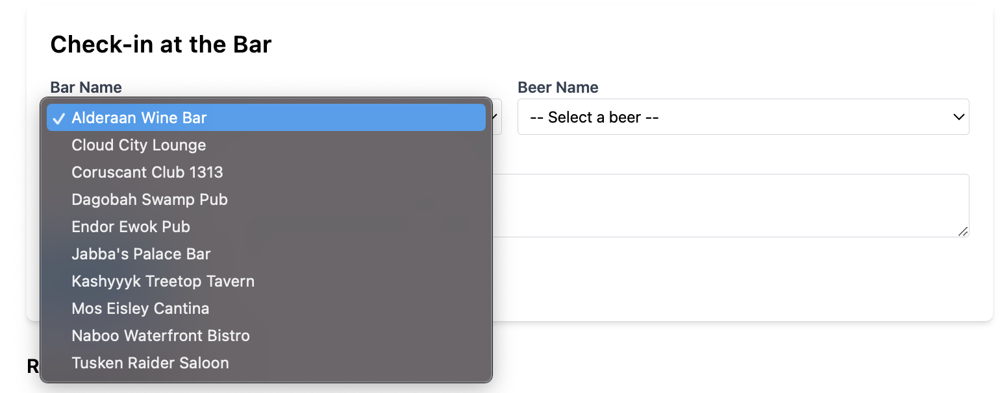
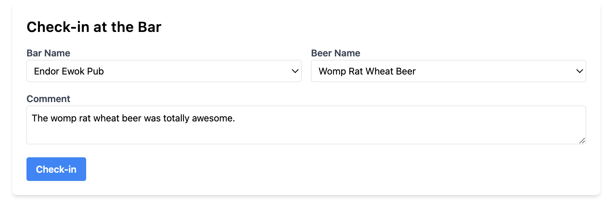

Na het toevoegen krijg je een succes message te zien.

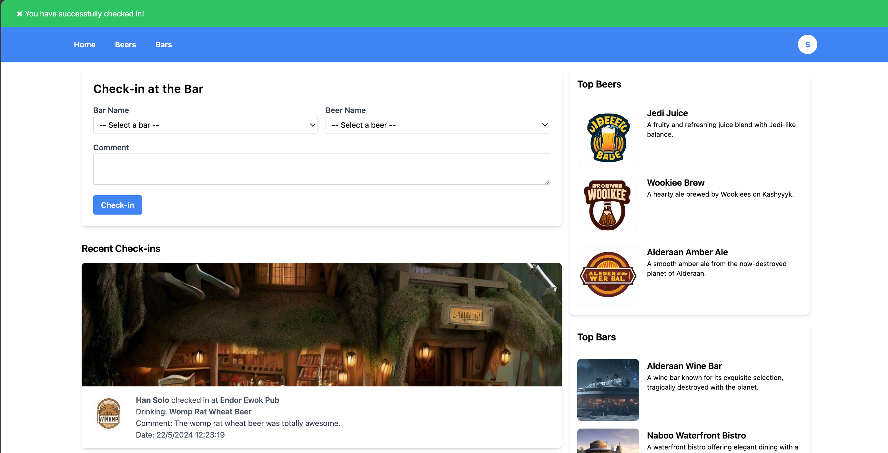

### Top Bar

De top bar toont de top 3 bars met de hoogste rating. Je toont de naam van de bar en de description. Je toont ook een willekeurige afbeelding van de bar. Als je op de naam van de bar klikt, ga je naar de detailpagina van de bar.

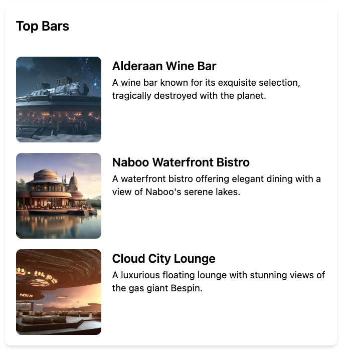

### Top Beers

De top beers toont de top 3 bieren. Jammer genoeg is er geen rating voor de bieren, dus je toont gewoon de 3 bieren met de meeste check-ins. Je toont de naam van het bier en de description. Je toont ook het logo van het bier. Als je op een bier klikt, ga je naar de detailpagina van het bier.

## Beers pagina

Als je naar de /beers route gaat, krijg je een overzicht van alle bieren. Je toont de naam van het bier, de alcohol percentage en de description. Je toont ook het logo van het bier. Als je op een bier klikt, ga je naar de detailpagina van het bier.

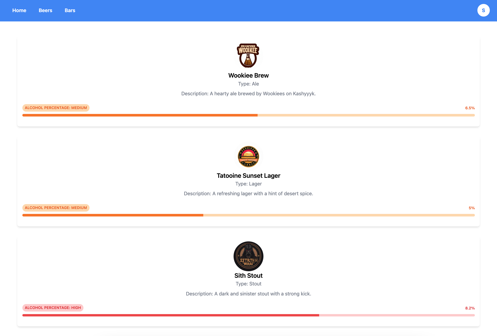

Je kan het percentage van het bier tonen in een kleur. Als het percentage lager is dan 5, toon je het in het groen. Als het percentage lager is dan 7.5, toon je het in het oranje. Anders toon je het in het rood. Je toont ook een label met `LOW`, `MEDIUM` of `HIGH` afhankelijk van het percentage. 

Je kan eventueel ook het alcohol percentage laten zien aan de hand van een balkje. Zoek zelf een manier om dit te implementeren.

## Beers detail pagina

Als je naar de /beers/:id pagina gaat, krijg je hetzelfde overzicht als op de beers pagina, maar dan enkel voor dat specifieke bier. Je toont ook een lijst van alle check-ins voor dat bier. Je toont de naam van de gebruiker, de naam van de bar, de datum en de comment. Je toont ook een willekeurige afbeelding van de bar.

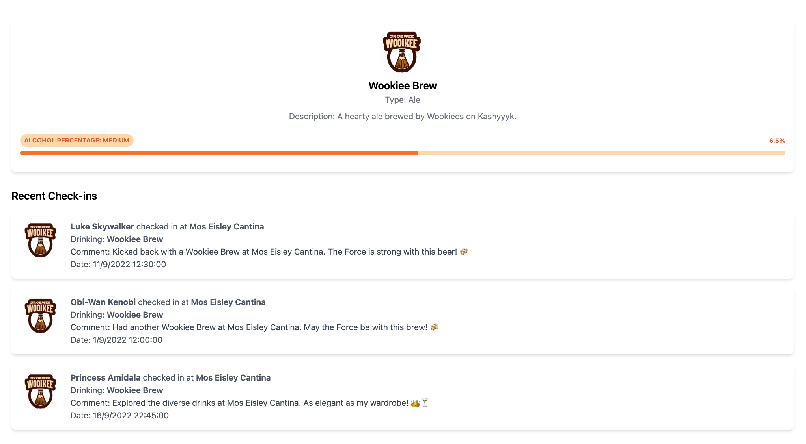

## Bars pagina

Als je naar de /bars route gaat, krijg je een overzicht van alle bars. Je toont de naam van de bar, de locatie en de description. Je toont ook de rating van de bar. Als je op een bar klikt, ga je naar de detailpagina van de bar.

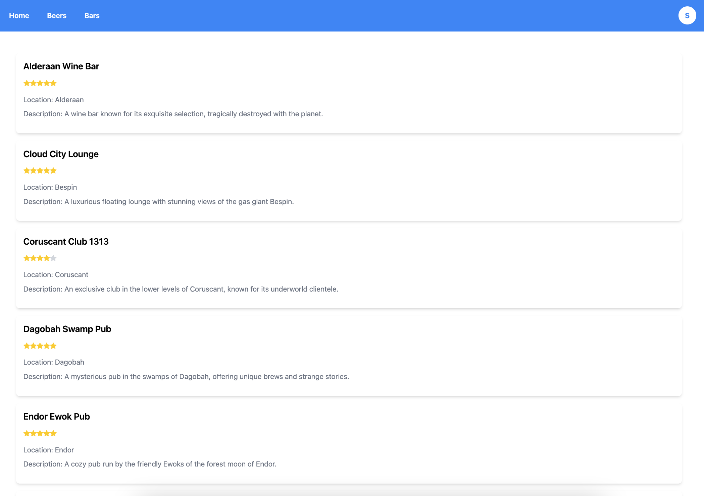

## Bars detail pagina

Als je naar de /bars/:id pagina gaat, krijg je hetzelfde overzicht als op de bars pagina, maar dan enkel voor die specifieke bar. Je toont hiernaast ook alle images van de bar. 

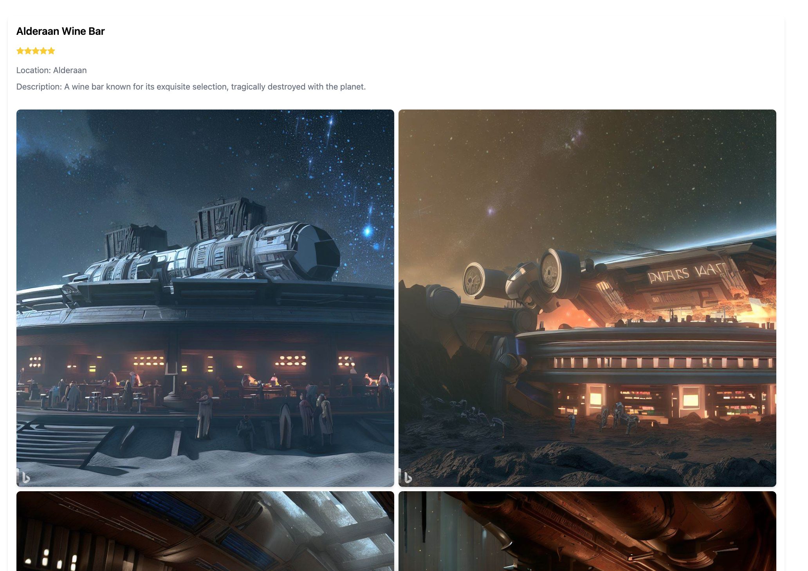

## Profile pagina

Je hebt bovenaan elke pagina (buiten de login pagina) een navigatiebalk. Rechtsbovenaan zie je een cirkel met de eerste letter van de je username. Als je hier op klikt krijg je een menu waar je kan kiezen tussen uitloggen en naar je profiel gaan.

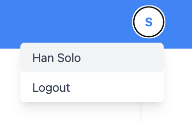

Als je naar je profiel gaat, zie je een overzicht van al je check-ins. Je krijgt ook je username en fullname te zien.

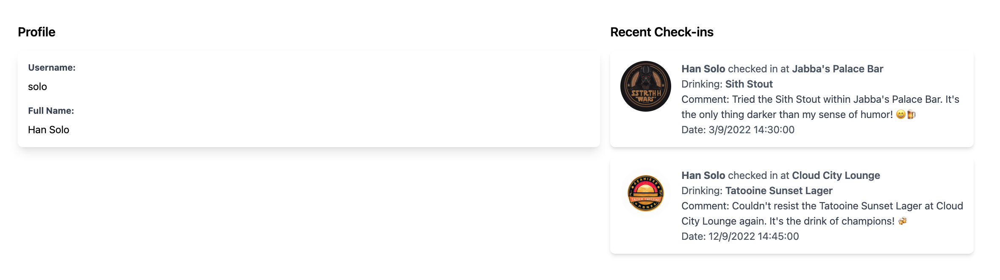