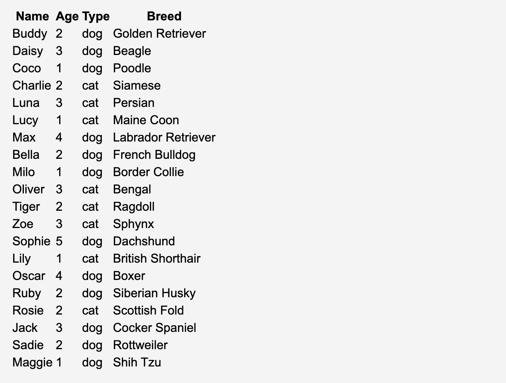
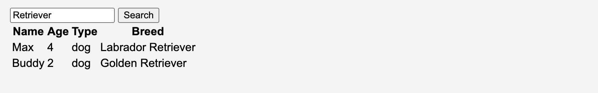

### Pet Shelter Express

Maak een nieuw project aan met de naam `pet-shelter-express` en installeer de `express` en `mongodb` package. 

We starten van de database die we gemaakt hebben in de vorige [opgave](../pet-shelter/README.md). We gaan nu een express applicatie maken die gebruik maakt van deze database.

- Zorg ervoor dat bij het opstarten van de express applicatie een verbinding wordt opgezet met de MongoDB database. En zorg ervoor dat deze verbinding wordt afgesloten bij het afsluiten van de applicatie.
- Maak gebruik van een aparte `database.ts` module om al je database gerelateerde code in te plaatsen.
- Maak een `/pets` route aan die alle pets toont in de database. Gebruik hiervoor een aparte `pets.ejs` view. 

- Maak een `/pets/:type` route aan die alle pets toont in de database van een bepaald type. Herbruik de `pets.ejs` view. `/pets/dog` toont alle honden, `/pets/cat` toont alle katten, ...
- Maak een `/pets/sort` route aan die alle pets toont in de database gesorteerd op een bepaald veld. Gebruik hiervoor een aparte `pets.ejs` view. Je kan het veld meegeven via een query parameter `field`. Mogelijke waarden voor `field` zijn `name`, `type` en `age`. De default waarde is `name`. Herbruik de `pets.ejs` view.
- Maak een `/pets/ageBetween` route aan die alle pets toont in de database met een leeftijd tussen een minimum en een maximum. Je kan een `min` en een `max` parameter meegeven via de query string. Herbruik de `pets.ejs` view. Als er geen `min` en `max` parameter meegegeven worden, dan worden alle pets getoond.
- Maak een `/pets/search` route aan die alle pets toont in de database waarvan de naam, type of breed overeenkomt met een bepaalde zoekterm. Je kan een `search` parameter meegeven via de query string. Gebruik hier een nieuwe `search.ejs` view voor waar je ook een zoekterm kan ingeven aan de hand van een formulier.

- Zorg ervoor dat de connection string in een `.env` bestand staat.