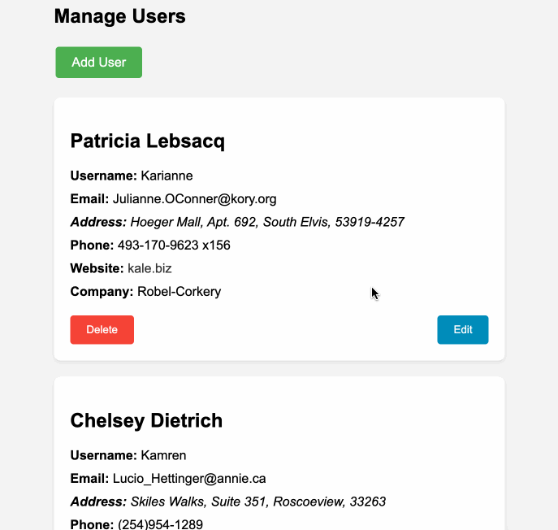

### Users CRUD express

Maak een nieuw project aan met de naam `users-crud-express` en installeer de `express` en `mongodb` package. 

We gaan een kleine CRUD applicatie maken die data gebruikt afkomstig van `https://jsonplaceholder.typicode.com/users`. In het begin van de applicatie worden al deze `users` ingelezen en opgeslagen in een MongoDB database. Vanaf de data in de database zit moet je dus geen requests meer doen naar de externe API.

- Zorg ervoor dat bij het opstarten van de express applicatie een verbinding wordt opgezet met de MongoDB database. En zorg ervoor dat deze verbinding wordt afgesloten bij het afsluiten van de applicatie.
- Maak gebruik van een aparte `database.ts` module om al je database gerelateerde code in te plaatsen.
- Voorzie de volgende routes:
    - `GET /users`: Toont een lijst van alle users.
    - `GET /users/create`: Toont een formulier om een nieuwe user toe te voegen.
    - `POST /users/create`: Voegt een nieuwe user toe aan de database.
    - `GET /users/:id/update`: Toont een formulier om een bestaande user aan te passen.
    - `POST /users/:id/update`: Past een bestaande user aan in de database.
    - `POST /users/:id/delete`: Verwijdert een user uit de database.
- Zorg ervoor dat je een gebruiker kan verwijderen door op een knop te klikken in de lijst van users.
- Zorg ervoor dat je een gebruiker kan aanpassen door op een knop te klikken in de lijst van users.
- zorg ervoor dat je een gebruiker kan toevoegen door op de `create` button te klikken.

