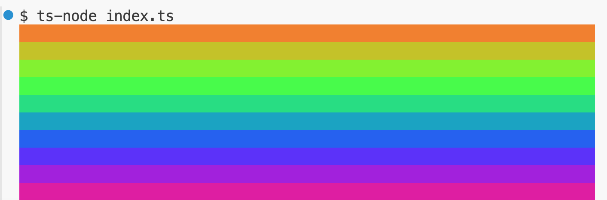

### Rainbow Chalk

Maak een nieuw project aan met de naam `rainbow-chalk`.

Installeer de volgende npm packages:
- chalk@4 (https://www.npmjs.com/package/chalk)
- rainbow-color-array-ts (https://www.npmjs.com/package/rainbow-colors-array-ts)

Bekijk goed de documentatie van de packages om te zien hoe je deze packages kunt gebruiken.

Maak een nieuwe file aan met de naam `index.ts`. Importeer de packages die je hebt geïnstalleerd. Gebruik de packages om een regenboog van kleuren te loggen naar de console.

Je kan dit doen door eerst een array van kleuren te genereren met de rainbow functie van de `rainbow-color-array-ts` package. Vervolgens kan je de kleuren loggen naar de console met de `chalk` package. 

#### Voorbeeld interactie

