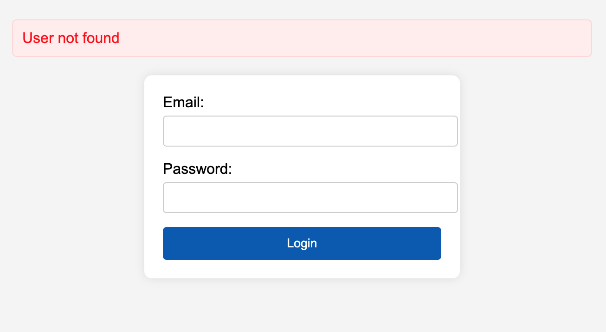
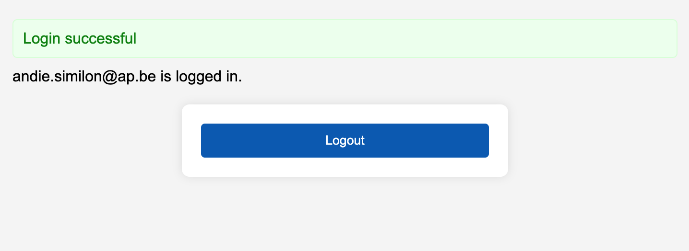

### Login-Express

Maak een nieuwe Express applicatie aan met de naam `login-express`. In deze applicatie gaan we een login systeem maken met de volgende vereisten:
- Een login pagina met een formulier waarin de gebruiker zijn e-mailadres en wachtwoord kan invullen.
- Een gebruiker kan inloggen met zijn e-mailadres en wachtwoord.
- Alle wachtwoorden moeten gehasht worden opgeslagen in de database. Gebruik hiervoor de bcrypt library.
- Als een gebruiker succesvol is ingelogd, wordt hij doorgestuurd naar een geheime pagina die zijn e-mailadres toont.
- Voorzie twee rollen: `admin` en `user`. 
- Gebruik een middleware om te controleren of een gebruiker is ingelogd.
- Gebruik een flash message om de gebruiker te informeren over fouten of successen bij het inloggen.
- Gebruik een sessie om de gebruiker ingelogd te houden. Deze sessie moet over 1 week vervallen.
- Voorzie een logout functionaliteit.

