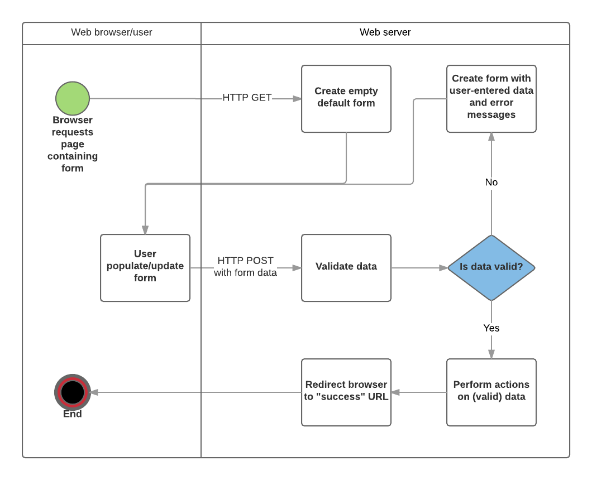

# POST Request

## POST Requests

Hoewel het perfect mogelijk is om data te versturen via een `GET` request, is het niet altijd de beste keuze. De data die je verstuurd via een `GET` request is zichtbaar in de URL. Bovendien is de hoeveelheid data die je kan versturen beperkt. De meeste browsers hebben een limiet van 2048 karakters. Dit is niet altijd voldoende. Daarom gebruiken we `POST` requests.

Bij een `POST` request wordt de data niet zichtbaar in de URL. De data wordt verstuurd in de body van het request. De body is een onderdeel van het request dat gebruikt wordt om data te versturen. Je zou de body kunnen zien als een brief die je in een enveloppe steekt. Bij de `GET` request zou je het bericht op de enveloppe schrijven, bij de `POST` request steek je het bericht in de enveloppe. Beide zullen de bestemming bereiken, maar de inhoud van de enveloppe is niet direct zichtbaar voor iedereen.

Opgelet: Het is niet zo dat `POST` requests veilig zijn. De inhoud van een `POST` request is ook leesbaar. Als we teruggrijpen naar de analogie van de enveloppe, dan kan iedereen de enveloppe openen en de inhoud lezen. Als je echt zeker wil zijn dat de data veilig verstuurd wordt, moet je de data versleutelen. Dit is een proces dat we later in de cursus zullen behandelen.

`GET` requests zijn ook niet geschikt voor operaties die een aanpassing teweegbrengen (zoals het versturen van een formulier). Dat komt onder meer omdat een paginarefresh zorgt dat het request opnieuw wordt uitgevoerd!

## Formulieren

Over het algemeen worden `POST` requests gebruikt om formulieren te versturen. Een formulier is een manier om data te versturen naar een server. Een formulier bestaat uit een aantal velden die ingevuld kunnen worden. Deze velden worden verstuurd naar de server wanneer de gebruiker op de knop "Verzenden" klikt. De data wordt verstuurd als een `POST` request.

Zo'n formulier kan er als volgt uit zien:

```html
<form action="/register" method="post">
      <div>
        <label for="fname">First name?</label>
        <input name="fname" id="fname" placeholder="George" type="text">
      </div>
      <div>
        <label for="lname">Last Name?</label>
        <input name="lname" id="lname" placeholder="Smith" type="text">
      </div>
      <div>
        <label for="email">Email?</label>
        <input name="email" id="email" type="email">
      </div>
      <div>
        <label for="lname">Password</label>
        <input name="password" id="password" type="password">
      </div>
      <div>
        <button type="submit">Register</button>
      </div>
</form>
```

Er zijn hier twee belangrijke dingen op te merken in dit voorbeeld:

* Het attribuut `action` bevat de URL waar de data naartoe gestuurd wordt. Dit is de route die we zullen gebruiken om de data te behandelen.
* Het attribuut `method` bevat de HTTP method die gebruikt wordt. In dit geval is dat `post`.

## Form Handling

Het proces om de data van een formulier te behandelen noemen we form handling. Dit is het proces waarbij de data van het formulier wordt opgevraagd en verwerkt. Hieronder een flowchart van het proces:



De meeste formulieren werken op deze manier.

1. De gebruiker krijgt een leeg formulier te zien bij de eerste keer dat de pagina wordt opgevraagd.
   * Het formulier kan lege velden bevatten (bv. als je een nieuw record aanmaakt) of het kan al ingevuld zijn met initiele waarden (bv. als je een record aanpast of nuttige standaardwaarden hebt).
2. De gebruiker vult dit formulier in en de data wordt verstuurd via een `POST` request naar de url die in het `action` attribuut van het `form` element staat.
3. De server ontvangt de data en valideert en sanitizeert deze.
   * Validatie is het proces waarbij de data wordt gecontroleerd op correctheid.
   * Sanitization is het proces waarbij de data wordt schoongemaakt. Dit is belangrijk om bv. SQL injecties te voorkomen (zie later)
4. Als er data ongeldig is, wordt het formulier opnieuw getoond, maar nu met de ingevulde waarden en foutmeldingen voor de velden die niet correct zijn.
5. Als alle data geldig is, worden de nodige acties uitgevoerd (bv. de data wordt opgeslagen in de database, een notificatie email wordt verstuurd, het resultaat van een zoekopdracht wordt teruggegeven, een bestand wordt geupload, etc.)
6. Als alle acties zijn uitgevoerd, wordt de gebruiker doorgestuurd naar een andere pagina.

Vaak wordt form handling code geïmplementeerd met een GET route voor de initiële weergave van het formulier en een POST route naar dezelfde route voor de validatie en verwerking van de formuliergegevens.

### Het lege formulier

Het eerste wat je moet doen is een route maken die het lege formulier toont. Dit is een `GET` route die de HTML van het formulier teruggeeft.

```typescript
app.get("/register", (req, res) => {
  res.render("register");
});
```

### Het formulier verwerken

Naast een `GET` route, maken we ook een `POST` route die de data van het formulier verwerkt. Die mag op dezelfde URL staan als de `GET` route. Express weet welke functie uitgevoerd moet worden op basis van de HTTP method die gebruikt wordt.

```typescript
app.post("/register", (req, res) => {
  // code hier
});
```

Willen we de inhoud van de body van het `POST` request lezen dan moeten we nog een kleine aanpassing maken aan onze applicatie. Bovenaan onze applicatie (bij de andere `app.use` statements) voegen we de volgende regels toe:

```typescript
app.use(express.json({ limit: '1mb' }));
app.use(express.urlencoded({ extended:true}))
```

De waarde voor `limit` kies je zelf. Dit is de maximale grootte van het request. De tweede lijn zorgt ervoor dat de inhoud van de `POST` omgezet wordt in een handig JSON object.

We kunnen nu de velden van het formulier uitlezen met `req.body`.

```typescript
app.post("/register", (req, res) => {
  let fname: string = req.body.fname;
  let lname: string = req.body.lname;
  let email: string = req.body.email;
  let password: string = req.body.password;
  ...
});
```

### Validatie en error handling

Omdat je nooit kan vertrouwen op de data die je ontvangt, zelfs als er al in de browser zelf validatie is gebeurd, is het belangrijk om de data te valideren. Misschien hebben we een veld verplicht gemaakt, of willen we zeker zijn dat een emailadres een `@` bevat.

En als er iets misloopt willen we ook een foutmelding tonen. Deze moeten we dan meegeven aan de hand van het object in de `res.render` methode.

```typescript
app.post("/register", (req, res) => {
  let fname: string = req.body.fname;
  let lname: string = req.body.lname;
  let email: string = req.body.email;
  let password: string = req.body.password;

  if (fname === "" || lname === "" || email === "" || password === "") {
    res.render("register", { error: "All fields are required" });
  } else if (!email.includes("@")) {
    res.render("register", { error: "Invalid email" });
  } else {
    // code om de data te verwerken
  }
});
```

We moeten dan ook de error tonen in de view.

```html
<% if (error) { %>
  <p><%= error %></p>
<% } %>
```

Vergeet ook geen lege error message mee te geven in de `GET` route of we krijgen een error.

```typescript
app.get("/register", (req, res) => {
  res.render("register", { error: "" });
});
```

Er zijn ook libraries die je kan gebruiken om de validatie te vereenvoudigen. Een populaire library is [express-validator](https://express-validator.github.io/docs/).

### Afhandelen van de data

Als de data geldig is, kunnen we de nodige acties uitvoeren. Dit kan vanalles zijn: de data opslaan in een database, een notificatie email versturen, een bestand uploaden, etc. En vervolgens sturen we de gebruiker door naar een andere pagina aan de hand van een redirect.

```typescript
app.post("/register", (req, res) => {
  let fname: string = req.body.fname;
  let lname: string = req.body.lname;
  let email: string = req.body.email;
  let password: string = req.body.password;

  if (fname === "" || lname === "" || email === "" || password === "") {
    res.render("register", { error: "All fields are required" });
  } else if (!email.includes("@")) {
    res.render("register", { error: "Invalid email" });
  } else {
    console.log("Data is valid, saving user");
    
    res.redirect("/success");
  }
});
```

## Andere form elementen

Hier onder een formulier met een groot aantal mogelijke form elementen.

```html
<form action="/submit_form" method="post">
    <!-- Text Input -->
    <label for="name">Name:</label><br>
    <input type="text" id="name" name="name"><br>

    <!-- Email Input -->
    <label for="email">Email:</label><br>
    <input type="email" id="email" name="email"><br>

    <!-- Password Input -->
    <label for="password">Password:</label><br>
    <input type="password" id="password" name="password"><br>

    <!-- Number Input -->
    <label for="age">Age:</label><br>
    <input type="number" id="age" name="age" min="0"><br>

    <!-- Date Input -->
    <label for="dob">Date of Birth:</label><br>
    <input type="date" id="dob" name="dob"><br>

    <!-- Radio Buttons -->
    <p>Gender:</p>
    <input type="radio" id="male" name="gender" value="male">
    <label for="male">Male</label><br>
    <input type="radio" id="female" name="gender" value="female">
    <label for="female">Female</label><br>
    <input type="radio" id="other" name="other" value="other">
    <label for="other">Other</label><br>

    <!-- Checkbox -->
    <p>Hobbies:</p>
    <input type="checkbox" id="hobby1" name="hobby1" value="Sports">
    <label for="hobby1"> Sports</label><br>
    <input type="checkbox" id="hobby2" name="hobby2" value="Reading">
    <label for="hobby2"> Reading</label><br>

    <!-- Dropdown List -->
    <label for="country">Country:</label><br>
    <select id="country" name="country">
        <option value="usa">United States</option>
        <option value="canada">Canada</option>
        <option value="uk">United Kingdom</option>
    </select><br>

    <!-- Dropdown Mutliple -->
    <label for="languages">Languages</label><br>
    <select id="languages" name="languages" multiple>
        <option value="english">English</option>
        <option value="spanish">Spanish</option>
        <option value="french">French</option>
        <option value="german">German</option>
    </select><br>

    <!-- Textarea -->
    <label for="bio">Bio:</label><br>
    <textarea id="bio" name="bio" rows="4" cols="50"></textarea><br>

    <!-- Hidden Input -->
    <input type="hidden" id="hiddenElement" name="hiddenElement" value="hiddenValue">

    <!-- Color Input -->
    <label for="color">Favorite Color:</label><br>
    <input type="color" id="color" name="color"><br>

    <!-- Range Input -->
    <label for="range">Range:</label><br>
    <input type="range" id="range" name="range" min="0" max="100"><br>

    <!-- Year Input -->
    <label for="year">Year:</label><br>
    <input type="number" id="year" name="year" min="1900" max="2099" step="1" value="2021"><br>

    <!-- Week Input -->
    <label for="week">Week:</label><br>
    <input type="week" id="week" name="week"><br>
    

    <input type="submit" value="Submit">
</form>
```

Deze kan je op de volgende manier uitlezen:

```typescript
app.post("/submit_form", (req, res) => {
    let name : string = req.body.name;   
    let email : string = req.body.email;
    let password : string = req.body.password;
    let age : number = parseInt(req.body.age);
    let dob : Date = new Date(req.body.dob);
    let gender : Gender = req.body;
    let country : Country = req.body.country;
    let languages: Language[] = req.body.languages;
    let bio: string = req.body.bio;
    let hiddenElement: string = req.body.hiddenElement;
    let color: string = req.body.color;
    let range: number = parseInt(req.body.range);
    let year: number = parseInt(req.body.year);
    let week: string = req.body.week;


    res.send(req.body);
});
```

Twijfel je? Dan kan je altijd gewoon het `req.body` object afprinten via `console.log` en kijken wat erin zit.
