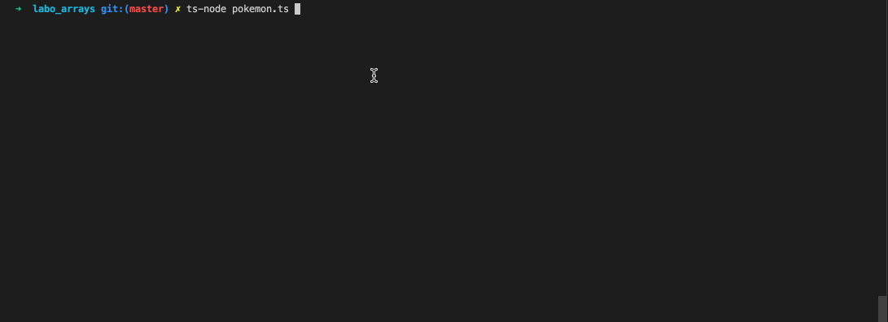
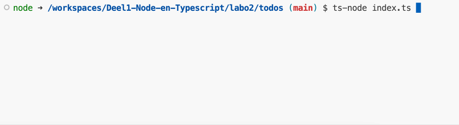
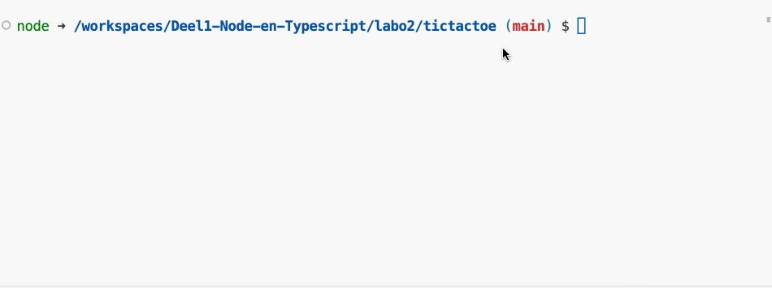

# Labo 3

## Theorie

Bekijk voor het labo aan te vangen eerst de volgende topics:

* [Basis types](../nodejs-+-typescript/type-systeem/basic-types.md) (enkel string, number en boolean)
* [Arrays](../nodejs-+-typescript/type-systeem/arrays.md)
* [Input Lezen](../nodejs-+-typescript/input-lezen.md) (menu)

## Oefeningen

### Som van getallen

Maak een nieuw project aan met de naam `som-van-getallen`.

We willen een programma maken dat de som van een aantal getallen berekent. De gebruiker zal eerst moeten ingeven hoeveel getallen hij wil optellen. Vervolgens zal hij de getallen moeten ingeven. Het programma zal dan de som van de getallen tonen.

De getallen moeten opgeslagen worden in een array. Je mag een for loop gebruiken om de som te berekenen.

#### Voorbeeld interactie

```bash
Hoeveel getallen wil je optellen? 3
Geef getal 1 in: 5
Geef getal 2 in: 3
Geef getal 3 in: 7
De som van de getallen is 15
```

### Puntenboek

Maak een nieuw project aan met de naam `puntenboek`.

We willen een programma maken dat de punten van een aantal studenten bijhoudt. De gebruiker geeft de punten van de studenten op 20 in. Als de gebruiker geen punten meer wil ingeven dan geeft hij een lege string in.

Het programma zal dan het gemiddelde van de punten tonen. Het geeft ook het aantal studenten dat een onvoldoende heeft (minder dan 10 punten).

#### Voorbeeld interactie

```bash
Geef de punten van student 1 in: 5
Geef de punten van student 2 in: 6
Geef de punten van student 3 in: 10
Geef de punten van student 4 in: 
Het gemiddelde van de punten is 6
Het aantal studenten met een onvoldoende is 2
```

### Rot13

Maak een nieuw project aan met de naam `rot13`.

We willen een programma maken dat een string encodeert met de rot13 methode. De rot13 methode is een simpele methode om een string te coderen. Elke letter wordt vervangen door de letter die 13 plaatsen verder in het alfabet staat. Als je aan het einde van het alfabet komt dan ga je terug naar het begin.

De gebruiker geeft een string in en het programma toont de gecodeerde string.

<figure><figcaption></figcaption></figure>

De werkwijze is als volgt:

* Je begint met een array van het alfabet in kleine letters.
* Je vraagt de gebruiker om een string in te geven.
* Je gaat door elke letter van de string en je zoekt de index van de letter in de array van het alfabet.
* Je telt 13 op bij de index en je neemt de modulo van 26. Dit is de nieuwe index van de letter.
* Je neemt de letter op de nieuwe index en je voegt deze toe aan een nieuwe string.
* Als de letter een spatie is of een ander teken dan een letter dan voeg je deze ook toe aan de nieuwe string. Je moet dus controleren of de letter in de array van het alfabet staat.

#### Voorbeeld interactie

```bash
Enter a string: hello
uryyb
```

### Pokemon team

Maak een nieuw project aan met de naam `pokemon`&#x20;

Gegeven is de volgende array van 20 pokemon:

```
let pokemon: string[] = [
    "Bulbasaur",
    "Ivysaur",
    "Venusaur",
    "Charmander",
    "Charmeleon",
    "Charizard",
    "Squirtle",
    "Wartortle",
    "Blastoise",
    "Caterpie",
    "Metapod",
    "Butterfree",
    "Weedle",
    "Kakuna",
    "Beedrill",
    "Pidgey",
    "Pidgeotto",
    "Pidgeot",
    "Rattata",
    "Raticate",
    "Spearow",
];
```

* Maak een variabele `team`van het type string\[]. Deze array bevat de pokemon van de gebruiker van het programma.
* Gebruik een lus om de pokemon te tonen aan de gebruiker. Toon eerst de index gevolgd door de naam van de pokemon. Je gebruikt dus nog NIET de ingebouwde `keyInSelect` van de readline-sync library.

```
0. Bulbasaur
1. Ivysaur
2. Venusaur
3. Charmander
4. Charmeleon
...
```

* Vraag daarna aan de gebruiker welke pokemon er moet toegevoegd worden aan het team. Dit doe je aan de hand van de index van de pokemon. Dit doe je tot de gebruiker STOP ingeeft. Je kan dit doen aan de hand van een `do while` loop.

```
Welke pokemon wil je in je team? [0-20]: 4
Welke pokemon wil je in je team? [0-20]: 3
Welke pokemon wil je in je team? [0-20]: STOP
```

* Als de gebruiker een pokemon ingeeft die al in het team zet dan krijgt hij hiervan een melding en wordt de pokemon niet toegevoegd:

```
Welke pokemon wil je in je team? [0-20]: 4
Welke pokemon wil je in je team? [0-20]: 3
Welke pokemon wil je in je team? [0-20]: 4
Deze pokemon zit al in je team
Welke pokemon wil je in je team? [0-20]: 2
Welke pokemon wil je in je team? [0-20]: STOP
```

* Als de pokemon niet bekend is (dus het ingegeven nummer groter is dan de lengte van de array) wordt er ook een melding gegeven:

```
Welke pokemon wil je in je team? [0-20]: 21
Deze pokemon ken ik niet
Welke pokemon wil je in je team? [0-20]: 4
```

* Als je STOP hebt ingegeven dan wordt het team van de gebruiker op het scherm getoond:

```
Welke pokemon wil je in je team? [0-20]: 1
Welke pokemon wil je in je team? [0-20]: 2
Welke pokemon wil je in je team? [0-20]: 3
Welke pokemon wil je in je team? [0-20]: 4
Welke pokemon wil je in je team? [0-20]: 5
Welke pokemon wil je in je team? [0-20]: 6
Welke pokemon wil je in je team? [0-20]: STOP
Jouw team van pokemon is: 
1. Ivysaur
2. Venusaur
3. Charmander
4. Charmeleon
5. Charizard
6. Squirtle
```

**Voorbeeld interactie:**



### Todo list

Maak een nieuw project aan met de naam `todo-list`.

We willen een programma maken dat een todo lijst bijhoudt. De gebruiker kan taken toevoegen aan de lijst. De gebruiker kan ook taken op de lijst afvinken. Voorzie bij het opstarten van het programa twee arrays. Eén voor de taken en één voor de taken die afgevinkt zijn. Een taak is gewoon een string.

Bij het opstarten van de applicatie wordt er een menu getoond. De gebruiker kan kiezen uit de volgende opties:

```
[1] Add a task
[2] Show tasks
[3] Check a task
[4] Exit
```

Gebruik hiervoor de `keyInSelect` functie van de readline-sync library.

Als de gebruiker kiest voor "Add a task" dan kan hij een taak toevoegen aan de lijst. De taak wordt toegevoegd aan de array van de taken.

```
Enter a task: Task 1
```

Als de gebruiker kiest voor "Show tasks" dan worden de taken getoond. De taken die afgevinkt zijn worden getoond met een "X" ervoor. De taken die nog niet afgevinkt zijn worden getoond met een " " ervoor. Dit zal er als volgt uitzien:

```
1. [ ] Task 1
2. [X] Task 2
3. [X] Task 3
```

Als de gebruiker kiest voor "Check a task" dan kan hij een taak afvinken. De gebruiker geeft het nummer van de taak in die hij wil afvinken. De taak wordt dan verplaatst van de array van de taken naar de array van de afgevinkte taken.

```
[1] Task 1
[2] Task 2
[3] Task 3

What did you do? [1, 2, 3]: 2
```

Als de gebruiker kiest voor "Exit" dan stopt het programma.

#### **Voorbeeldinteractie:**

<figure><figcaption></figcaption></figure>

### Tic Tac Toe

Maak een nieuw project aan met de naam `tic-tac-toe`.

We willen een programma maken dat het spelletje Tic Tac Toe kan spelen. We gaan dit doen met een 2D array. We gaan het spel spelen met 2 spelers. De eerste speler zal altijd "X" zijn en de tweede speler "O".

We werken met een 2D array van 3x3. We gaan het spel spelen met de coordinaten van de array. De bovenste rij is 0, de middelste rij 1 en de onderste rij 2. De meest linkse kolom is 0, de middelste kolom 1 en de meest rechtse kolom 2.

De gebruiker geeft de coordinaten in in de vorm van rij,kolom. Dus bijvoorbeeld 0,0 is de bovenste rij en de meest linkse kolom. 2,2 is de onderste rij en de meest rechtse kolom.

Als de gebruiker een zet doet op een plaats waar al een zet is gedaan dan krijgt hij een melding en moet hij opnieuw een zet doen.

Als de gebruiker een zet doet op een plaats die niet bestaat dan krijgt hij een melding en moet hij opnieuw een zet doen.

Als de gebruiker een zet doet die geldig is dan wordt het bord getoond. Als er een winnaar is dan wordt dit getoond en het programma stopt. Als het bord vol is en er is geen winnaar dan wordt dit getoond en het programma stopt.

#### Voorbeeld interactie:

<figure><figcaption></figcaption></figure>
