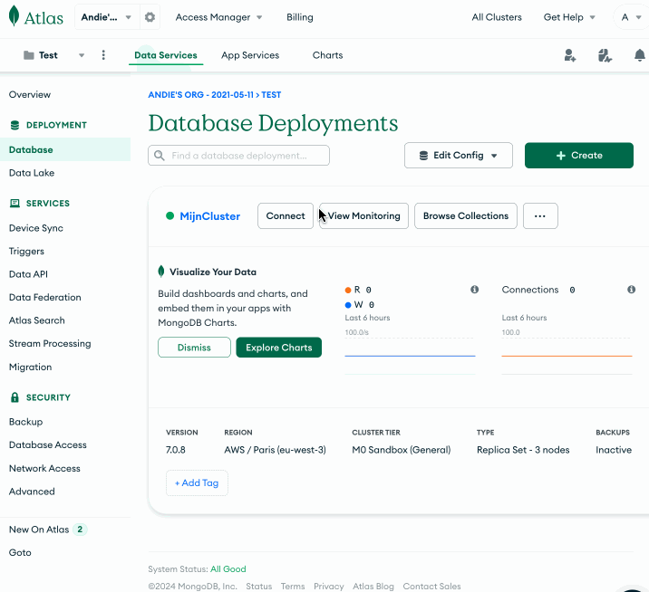

# 13. Mongo Basics

Theorie

Bekijk voor het labo aan te vangen eerst de volgende topics:

* [Wat is MongoDB?](../mongodb/wat-is-mongodb.md)
* [MongoDB driver](../mongodb/mongodb-driver.md)
* [Insert](../mongodb/insert.md)
* [Find](../mongodb/find.md)

## Labo voorbereidingen

Beide stappen zijn nodig om de oefeningen te kunnen maken. We zullen zowel een devcontainer gebruiken als een cloud MongoDB server.

### Devcontainer

Vanaf dit labo moet je terug opnieuw een nieuwe devcontainer maken. Dit is nodig omdat we een template willen gebruiken waarin alles van MongoDB al geïnstalleerd is.

Dus voordat we oefeningen kunnen maken, moeten we eerst een nieuwe devcontainer maken. Je moet dit doen aan de hand van deze [github classroom](https://classroom.github.com/a/x5BE0Spw) link. Open deze link en maak een nieuwe repository aan en clone deze repository in je devcontainer.

Je zal opmerken dat de mongodb vscode extension al geïnstalleerd is. Dit is nodig om de oefeningen te maken. Probeer een verbinding te maken met de MongoDB server via de extension. De connection string is `mongodb://localhost:27017`.

### Cloud MongoDB (Atlas)

#### 1. Maak een account aan

Ga naar [https://cloud.mongodb.com/](https://cloud.mongodb.com/) en maak een account aan. Na het maken van een account log in via je nieuwe account. Maak vervolgens een nieuwe **Shared Cluster** (is volledig gratis) aan**.**  Kies **AWS**, kies dan als regio: **eu-west-1** in ireland of **eu-central-1** in frankfurt en geef je cluster een naam. Klik vervolgens op **Create Cluster**

**Het aanmaken van je cluster kan tot 5 minuten duren! Hou hier rekening mee**

#### 2. Stel je security settings in

Ga terug naar het overzicht van de clusters en klik op **connect** en bij **Whitelist a connection IP address** kies je Add different ip address. Geef daar `0.0.0.0` in.&#x20;

Als je dit niet vindt, ga links naar **Network Access** en voeg 0.0.0.0 toe als IP adres.

#### 3. Maak een MongoDB gebruiker aan

Vervolgens maak je een nieuwe MongoDB gebruiker aan in **Create a MongoDB User.** Zorg ervoor dat het paswoord kan gedeeld worden met ons zodat we ook toegang tot de database hebben.&#x20;

Als je dit niet vindt, ga links naar **Database Access** en voeg een user toe.

#### 4. Haal jouw connection string op

Ga dan verder door op **Choose a connection method** (of connect) te klikken. Je kan hier twee connection strings vinden:

* Een voor de MongoDB extensie in vscode&#x20;
* Een voor de MongoDB driver voor node js

Deze zijn iets verschillend van elkaar. Let op dat je hier uiteraard je eigen username en paswoord in geeft.

<figure><figcaption></figcaption></figure>

#### 5. Verbinding uitproberen

Gebruik de connection string om via de extensie in vscode te verbinden met deze mongodb database.
