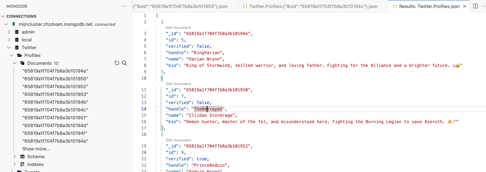

# Wat is MongoDB?

Tot nu toe hebben we enkel gewerkt met in-memory data. Dit wil zeggen dat we data in een array steken en deze array in het geheugen houden. Wanneer de server stopt, is deze data weg. Dit is niet handig wanneer we data willen bijhouden die we later willen opvragen. Daarom gaan we nu werken met een database. We zouden kunnen werken met een relationele database zoals MySQL, maar we gaan werken met MongoDB omdat dit beter aansluit bij de manier waarop we data bijhouden in TypeScript (JSON).

Door een database te gebruiken, kunnen we data bijhouden die we later kunnen opvragen. We kunnen data toevoegen, aanpassen, verwijderen en opvragen. Dit noemen we CRUD operaties (Create, Read, Update, Delete).

## MongoDB vs Relational DB

MongoDB is een NoSQL database. Hier zijn enkele verschillen tussen een relationele database en een NoSQL database:

Een relationele database:

* data verspreid over tabellen
* gestructureerde data
* structuur moeilijk aan te passen
* goed voor ingewikkelde queries

Een NoSQL database:

* data wordt bijgehouden als "documents" / JSON
* dynamische data
* structuur is makkelijk aanpasbaar
* goed voor simpele queries

Je kan echter de logica van relationele databases mappen op die van NoSQL:

* een record in RDB komt overeen met een MongoDB"s document (JSON object)
* een tabel in RDB komt overeen met MongoDB"s collection
* `_id` is unieke identifier (indexed) voor elk document net zoals je een ID met primary key zou toevoegen aan een relationele database tabel

Laten we een eenvoudig voorbeeld nemen van een tabel met persoonsgegevens:

| firstName | lastName | email               |
| --------- | -------- | ------------------- |
| Sven      | Charleer | sven.charleer@ap.be |
| Andie     | Similon  | andie.similon@ap.be |

In NoSQL stellen we dit als volgt voor:

```typescript
[
  {
    firstname: "Sven",
    lastname: "Charleer",
    email: "sven.charleer@ap.be"
  },
  {
    firstname: "Andie",
    lastname: "Similon",
    email: "andie.similon@ap.be"
  },

]
```

## MongoDB Atlas

Om MongoDB te gebruiken, moeten we uiteraard een MongoDB server hebben. Het is mogelijk om een MongoDB server te installeren op je eigen machine, maar dit is niet altijd handig. Daarom kan je gebruik maken van MongoDB Atlas. Dit is een cloud service die ons toelaat een MongoDB server te gebruiken zonder dat we deze zelf moeten installeren.

Om MongoDB Atlas te gebruiken, kan je een account aanmaken op [https://www.mongodb.com/atlas](https://www.mongodb.com/atlas) en hier een database aanmaken. Je kan dan een connectie string genereren die je later kan gebruiken om te connecteren op de database.

Let zeker op dat je voor deze cursus een gratis cluster aanmaakt. Dit is voldoende voor onze doeleinden.

## Devcontainer

Als je applicatie in productie draait moet je uiteraard gebruik maken van een mongodb server die online staat (zoaals MongoDB Atlas). Maar tijdens het ontwikkelen kan je gebruik maken van een mongodb server die lokaal draait. Dit kan je doen door een mongodb server te installeren op je eigen machine of door gebruik te maken van een devcontainer die een mongodb server bevat.

Er is jammer genoeg geen standaard devcontainer die typescript en mongodb bevat. Maar dankzij de flexibiliteit van devcontainers kunnen we zelf een devcontainer maken die typescript en mongodb bevat. Dit is buiten de scope van deze cursus, dus we gaan gebruik maken van een voorgemaakte template.

Als je wil connecteren met een lokale mongodb server in een devcontainer, kan je gebruik maken van volgende connectie string: `mongodb://localhost:27017`.

## MongoDB for VS Code

Om MongoDB te gebruiken in Visual Studio Code, kan je de MongoDB for VS Code extension installeren. Deze extension laat je toe om MongoDB databases te beheren vanuit VS Code.

Om deze extension te installeren, ga je naar de extensions tab in VS Code en zoek je naar "MongoDB for VS Code". Klik op install om de extension te installeren.




Als je gebruik maakt van MongoDB Atlas, kan je de connectie string die je daar hebt aangemaakt, gebruiken in de MongoDB for VS Code extension. Dit laat je toe om de database te beheren vanuit VS Code. Bij een lokale MongoDB server kan je de connectie string `mongodb://localhost:27017` gebruiken.

