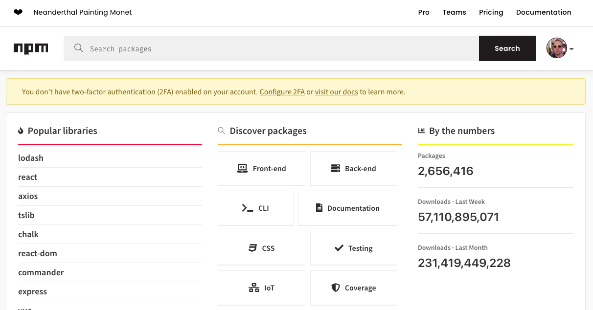
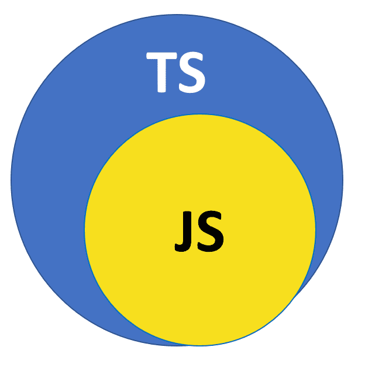

# Modules

## Eigen Modules Maken
### Wat zijn modules?

Modules zijn een manier om je code te organiseren in verschillende bestanden. Vaak wil je bepaalde functies beschikbaar maken voor andere bestanden. Dit kan je doen door deze functies in een module te zetten. Je kan dan in andere bestanden deze module importeren en de functies gebruiken.

Eigenlijk heb je al modules gebruikt in vorige delen in de vorm van npm packages. Deze bevatten ook modules die je kan importeren in je eigen code.

### Hoe maak je een module?

Stel dat je een functie hebt om de oppervlakte te berekenen van een cirkel, vierkant en rechthoek.

```typescript
function areaCircle(r: number): number {
    return Math.PI * r * r;
}

function areaSquare(s: number): number {
    return s * s;
}

function areaRectangle(l: number, w: number): number {
    return l * w;
}
```

Tot nu toe heb je altijd deze functies in hetzelfde bestand gezet. Maar stel dat je deze functies ook in een ander bestand wil gebruiken. Dan kan je deze functies in een module zetten door gebruik te maken van een `export` statement.

<pre class="language-typescript"><code class="lang-typescript"><strong>export function areaCircle(r: number): number {
</strong>    return Math.PI * r * r;
}

export function areaSquare(s: number): number {
    return s * s;
}

export function areaRectangle(l: number, w: number): number {
    return l * w;
}
</code></pre>

Zorg er wel voor dat je deze functies in een apart bestand zet met de extensie `.ts`. In dit geval bijvoorbeeld `area.ts`.

### Hoe importeer je functies uit een module?

Wil je deze functies gebruiken in een ander bestand? Dan moet je deze eerst importeren aan de hand van het volgende commando.

```typescript
import { areaCircle, areaSquare, areaRectangle } from './area';
```

De functies die je wil importeren zet je tussen de accolades. Het gedeelte achter `from` is het pad naar het bestand waar de module in staat. In dit geval is dat `./area` omdat het bestand `area.ts` in dezelfde map staat als het bestand waar je de functies wil gebruiken. Plaats je de module in een andere map, dan moet je het pad aanpassen. Staat je `area.ts` bestand in de directory `functions` dan moet je het volgende commando gebruiken.

```typescript
import { areaCircle, areaSquare, areaRectangle } from './functions/area';
```

nu kan je deze functies gebruiken in je code net zoals je dat zou doen alsof ze in hetzelfde bestand staan.

```typescript
console.log(areaCircle(2));
console.log(areaSquare(2));
```

### Default exports

Heel vaak wordt er door een module maar één functie geëxporteerd. In dat geval kan je gebruik maken van een default export. Dit is een export zonder naam.

```typescript
export default funtion(r: number): number {
    return Math.PI * r * r;
}
```

Je kan deze functie dan importeren zonder tussen de accolades te zetten.

```typescript
import areaCircle from './area';
```

In principe maakt het niet uit welke naam je achter de import zet want er is maar één functie geëxporteerd.

```typescript
import area from './area';
```

### Interfaces exporteren

Tot nu toe hebben we altijd interfaces in hetzelfde bestand gezet als de code die deze interface gebruikt. Maar je kan ook interfaces exporteren uit een module.

```typescript
export interface Person {
    name: string;
    age: number;
}
```

We plaatsen deze interfaces vaak in een apart bestand met de naam `types.ts`. We kunnen deze dan importeren in een ander bestand.

```typescript
import { Person } from './types';
```

## Npm Packages

## npm.js

npm.js is de package manager voor JavaScript. Het is de grootste software registry ter wereld. Hier vind je heel veel packages die je kan gebruiken in je projecten. Je kan deze packages installeren aan de hand van het volgende commando.

```bash
npm install <package-name>
```

Wil je een bepaalde package zoeken dan kan je dat doen op de [npmjs website](https://www.npmjs.com/). Je vind er ook uitgebreide documentatie over de packages en hoe je deze kan gebruiken. 



## Importeren van npm packages

Dit is ook de manier hoe je meestal npm packages importeert. Daar maakte het ook nooit uit welke naam je achter de import zette.

```typescript
import readline from 'readline-sync';
```

Deze functies kon je dan gebruiken door middel van de naam die je achter de import zette gevongd door een punt.

```typescript
const name = readline.question('Wat is je naam? ');
```

## Voorbeeld: Chalk

We gaan in dit voorbeeld de `chalk` package gebruiken. Deze package zorgt ervoor dat je tekst in de terminal kan kleuren. We gaan een programma maken dat de naam van de gebruiker in het rood toont.

Het eerste wat we moeten doen is de package installeren.

```bash
npm install chalk@4
```

Opgelet we moeten hier de versie 4 installeren omdat de nieuwste versie niet werkt met `ts-node` (en oudere versies van node)

Vervolgens bekijken we de documentatie van de package op de [npmjs website](https://www.npmjs.com/package/chalk). Hier vinden we hoe we de package kunnen gebruiken.

```typescript
import chalk from 'chalk';

const name = 'Jelle';

console.log(chalk.red(name));
```

Dit zal de naam `Jelle` in het rood tonen in de terminal.

## Importeren van types

[http://definitelytyped.github.io/](http://definitelytyped.github.io/)

Af en toe kom je in contact met een npm package die geen meegeleverde types hebben. Dit is bijvoorbeeld het geval bij de `readline-sync` package. In dat geval kan je gebruik maken van de `@types` (ook gekend als DefinitelyTyped) packages. Deze bevatten de types die bij de npm package horen. Je moet deze dan wel altijd apart installeren.

```bash
npm install --save-dev @types/readline-sync
```

Een overzicht van alle `@types` packages die je nodig hebt in deze cursus:

```bash
npm install --save-dev @types/node
npm install --save-dev @types/readline-sync
npm install --save-dev @types/express
npm install --save-dev @types/ejs
...
```

Je kan op de npmjs website heel eenvoudig zien of een bepaalde package TypeScript support heeft:

* Bevat deze een  tag? Dan kan je deze installeren aan de hand van de bovenstaande commando's
* Bevat deze een  tag, dan zitten de types al in de npm package en dan hoef je niets te doen.

Bevat deze geen van beide? Dan heb je helemaal geen types en heb je geen voordelen van TypeScript. Je moet dan ook nog een extra aanpassing doen aan je project om deze library toch nog te gebruiken.

Bijvoorbeeld de `rainbow-colors-array` package bevat geen TypeScript support en geen `@types` package. Je kan deze dan toch nog gebruiken door in je project een `types.d.ts` bestand aan te maken met de volgende inhoud.

```typescript
declare module 'rainbow-colors-array';
```

Dit is ook wat je vscode je aanraad als je over de error hovered als hij de types niet vindt:

<figure><figcaption></figcaption></figure>

## Voorbeeld: Lodash

We gaan in dit voorbeeld de `lodash` package gebruiken. Deze package bevat heel veel handige functies die je kan gebruiken in je projecten. Het is een soort zwitsers zakmes voor JavaScript. 

We installeren deze library aan de hand van het volgende commando.

```bash
npm install lodash
```

Deze library heeft geen ingebouwde types. We moeten deze dus apart installeren.

```bash
npm install --save-dev @types/lodash
```

Vaak is de documentatie bedoeld voor een ouder module systeem. We moeten dan de documentatie aanpassen naar het nieuwe module systeem.

```typescript
var _ = require('lodash');
```

Dit moeten we aanpassen naar het nieuwe module systeem.

```typescript
import _ from 'lodash';
```

Vervolgens kunnen we de functies gebruiken zoals beschreven in de documentatie. 

Bv de `reverse` functie.

```typescript
const array = [1, 2, 3];

console.log(_.reverse(array));
```

of de `round` functie.

```typescript
console.log(_.round(4.006, 2));
```

In die oefeningen zullen we nog een aantal handige functies van `lodash` bekijken.


