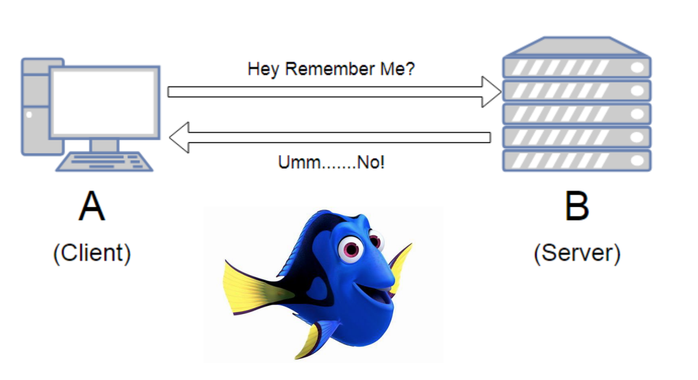
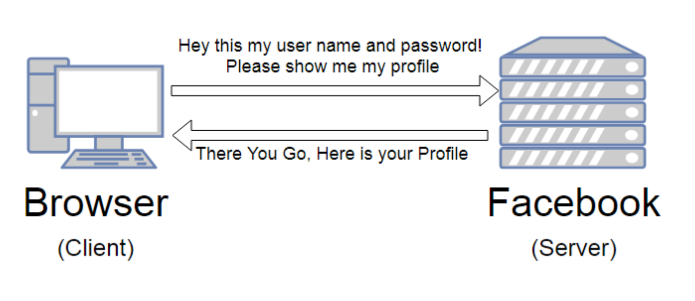
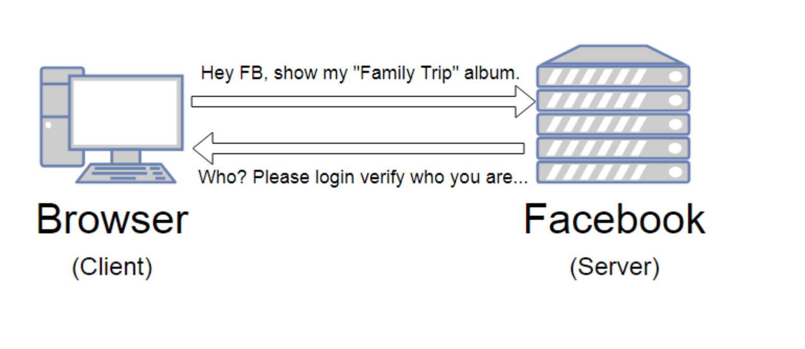
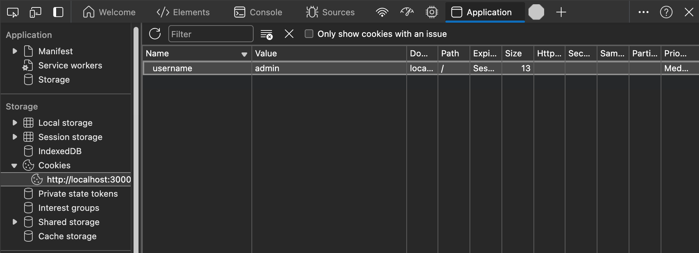
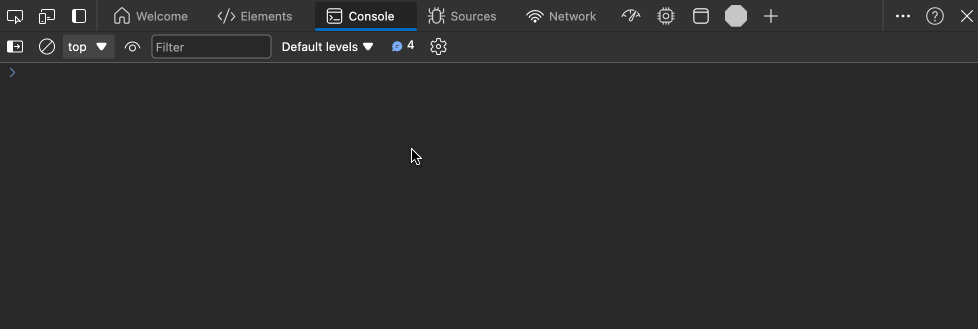

# Cookies

## Stateless HTTP

HTTP is een stateless protocol. Dit betekent dat de server geen informatie bijhoudt over de client. Elke request is onafhankelijk van de vorige. Doe je een request naar de server, dan weet de server niet wie je bent of wat je vorige requests waren.



Dit maakt het uiteraard moeilijk om bijvoorbeeld bij te houden of een gebruiker ingelogd is of niet.



Ook al heb je de eerste keer een login en paswoord meegegeven zal de tweede keer dat je de pagina bezoekt, de server niet weten wie je bent. Je zal dus opnieuw moeten inloggen.



## Cookies

De oplossing voor dit probleem is gebruik maken van cookies. Cookies zijn kleine stukjes data die de client kan opslaan in de browser. Bij elke request naar de server worden deze cookies meegestuurd. De server kan deze cookies lezen en zo weet de server wie de client is.

### Cookies in Express

#### Installatie
Express heeft een middleware die het makkelijk maakt om cookies te gebruiken: `cookie-parser`. Je kan deze als volgt installeren:

```typescript
npm install cookie-parser
npm install --save-dev @types/cookie-parser
```

Vervolgens kan je deze middleware toevoegen aan je Express-applicatie:

```typescript
import cookieParser from "cookie-parser";

const app = express();
app.use(cookieParser());
```

#### Cookies instellen

Stel dat we nu een formulier hebben waarbij de gebruiker zijn naam kan invullen. Als de gebruiker dit doet, willen we dat de gebruiker op de profielpagina terechtkomt en dat de naam van de gebruiker onthouden wordt de volgende keer dat de gebruiker de pagina bezoekt.

```typescript
app.get("/", (req, res) => {
  res.render("index");
});

app.post("/", (req, res) => {
  res.cookie("username", req.body.username);
  res.redirect("/profile");
});
```

de `index.ejs` file:

```html
<form action="/" method="post">
  <input type="text" name="username" />
  <button type="submit">Submit</button>
</form>
```

#### Cookies uitlezen

Nu kunnen we de naam van de gebruiker uitlezen in de profielpagina:

```typescript
app.get("/profile", (req, res) => {
  let name: string = req.cookies.username;
  res.render("profile", { username: name });
});
```

de `profile.ejs` file:

```html
<h1>Welcome <%= username %></h1>
```

#### Cookies verwijderen

We kunnen ook cookies verwijderen aan de hand van de `clearCookie` methode:

```typescript
app.get("/removeName", (req, res) => {
  res.clearCookie("username");
  res.redirect("/");
});
```

en kunnen we een link toevoegen in de `profile.ejs` file:

```html
<a href="/removeName">Remove name</a>
```

### Beveiliging

Cookies zijn een krachtig instrument om informatie bij te houden over een gebruiker. Maar dit betekent ook dat je voorzichtig moet zijn met cookies. 

#### Cookies aanpassen in de browser

Je kan cookies aanpassen in de browser. Dit kan handig zijn om te testen wat er gebeurt als een cookie niet meer bestaat of als een cookie een andere waarde heeft. Dit betekent ook dat je niet zomaar gevoelige informatie in een cookie mag opslaan of dat je niet zomaar mag vertrouwen op de data die in een cookie staat.




#### Cookies instellen met een vervaldatum

Je kan ook een cookie instellen met een vervaldatum. Dit doe je door een extra argument mee te geven aan de `cookie` methode:

```typescript
res.cookie("username", req.body.username, { expires: new Date(Date.now() + 900000) });
```

De vervaldatum is een `Date` object. In dit geval zal de cookie 15 minuten geldig zijn (900000 milliseconden) en daarna automatisch verwijderd worden.

Je kan ook de `maxAge` property gebruiken om de vervaldatum in milliseconden mee te geven:

```typescript
res.cookie("username", req.body.username, { maxAge: 900000 });
```

#### HttpOnly

Een heel belangrijke eigenschap van cookies is `HttpOnly`. Als je een cookie instelt met de `HttpOnly` eigenschap, dan kan de cookie niet aangepast worden door client-side JavaScript. Dit is belangrijk om te voorkomen dat een aan stuk kwaadaardige JavaScript code de cookie aanpast en zo bijvoorbeeld de sessie van een gebruiker overneemt.

```typescript
res.cookie("username", req.body.username, { httpOnly: true });
```
Als je een cookie instelt zonder httpOnly kan je met JavaScript de cookie aanpassen in de browser console:

```
document.cookie = "username=John Doe";
```

of hem ophalen:

```
console.log(document.cookie)
```

Je zal opmerken dat de cookie niet kan uitgelezen worden of aangepast worden als je de `httpOnly` property instelt.



#### Secure

Een andere belangrijke eigenschap van cookies is `Secure`. Als je een cookie instelt met de `Secure` eigenschap, dan kan de cookie enkel verstuurd worden over een beveiligde verbinding (HTTPS). 

```typescript
res.cookie("username", req.body.username, { secure: true });
```

#### SameSite

De `SameSite` eigenschap van een cookie bepaalt of een cookie meegestuurd mag worden bij een cross-site request. Dit is een belangrijke eigenschap om CSRF-aanvallen te voorkomen. 

```typescript
res.cookie("username", req.body.username, { sameSite: "strict" });
```

De `SameSite` eigenschap kan drie waarden hebben: `strict`, `lax` of `none`.

- `strict`: de cookie wordt enkel meegestuurd bij een same-site request. Dit betekent dat de cookie alleen wordt meegestuurd als de request naar dezelfde site is als waar de cookie is ingesteld.
- `lax`: de cookie wordt meegestuurd bij een same-site request en bij een cross-site request als het via een normale link is. Dit betekent bijvoorbeeld dat de cookie niet wordt meegestuurd als het via een POST request is.
- `none`: de cookie wordt altijd meegestuurd, ook bij cross-site requests. Dit kan enkel als de cookie ook de `Secure` eigenschap heeft.

### Voorbeelden

#### Winkel karretje

Een veelgebruikte toepassing van cookies is het bijhouden van een winkelkarretje. Als een gebruiker producten toevoegt aan zijn winkelkarretje, dan kan je deze producten bijhouden in een cookie. Zo weet je welke producten de gebruiker wil kopen.

```typescript
let items: string[] = [
    "Apple",
    "Banana",
    "Cherry",
    "Orange",
    "Raspberry",
    "Strawberry",
    "Watermelon",
];

app.get("/cart", (req, res) => {
    let add : string = typeof req.query.add === "string" ? req.query.add : "";
    let cart: string[] = req.cookies.cart ? JSON.parse(req.cookies.cart) : [];

    if (add) {
        cart.push(add);
        res.cookie("cart", JSON.stringify(cart));
    }

    res.render("cart", {
        items: items,
        cart: cart
    })
});
```

de `cart.ejs` file:

```html
<h1>Shop</h1>
<ul>
<% for (let item of items) { %>
    <li><a href="/cart?add=<%= item %>">Add <%= item %></a></li>
<% } %>
</ul>

<h1>Cart</h1>
<ul>
<% for (let item of cart) { %>
    <li><%= item %></li>
<% } %>
</ul>
```

Merk op dat we `JSON.stringify` en `JSON.parse` om een array van strings op te slaan in een cookie. Cookies kunnen enkel strings opslaan, dus we moeten de array omzetten naar een string. Je kan uiteraard ook andere objecten opslaan in een cookie aan de hand van `JSON.stringify` en `JSON.parse`. 

#### User settings

Een andere toepassing van cookies is het onthouden van gebruikersinstellingen. Als een gebruiker bijvoorbeeld de taal van de website wil veranderen, of het thema van de website wil aanpassen, dan kan je deze instellingen bijhouden in een cookie.

We maken eerst een interface aan voor de gebruikersinstellingen:

```typescript
interface UserSettings {
    theme: "dark" | "light";
    language: "NL" | "EN" | "FR";
}
```

Vervolgens maken we een GET route aan om het formulier tonen waar de gebruiker zijn instellingen kan aanpassen en een POST route om de instellingen op te slaan in een cookie:

```typescript
app.get("/settings", (req, res) => {
    const settings : UserSettings = req.cookies.settings ? JSON.parse(req.cookies.settings) : { darkMode: false, language: "EN" };
    res.render("settings", {
        settings
    });
});

app.post("/settings", (req, res) => {
    const settings : UserSettings = {
        theme: req.body.theme,
        language: req.body.language
    };
    res.cookie("settings", JSON.stringify(settings));
    res.redirect("/settings");
});
```

We kunnen nu de instellingen uitlezen in de `settings.ejs` file:

```html
<html>
    <head>
        <meta charset="UTF-8">
        <meta name="viewport" content="width=device-width, initial-scale=1.0">
        <link rel="stylesheet" href="/css/style.css">

        <% if (settings.theme === "dark") { %>
            <style>
                body {
                    background-color: black;
                    color: white;
                }
            </style>
        <% } else if (settings.theme === "light") { %>
            <style>
                body {
                    background-color: white;
                    color: black;
                }
            </style>
        <% } %>
    </head>
    <body>
        <% if (settings.language === "NL") { %>
            <h1>Instellingen</h1>
        <% } else if (settings.language === "EN") { %>
            <h1>Settings</h1>
        <% } else if (settings.language === "FR") { %>
            <h1>Paramètres</h1>
        <% } %>
        <form action="/settings" method="POST">
            <select name="language">
                <option <%= settings.language === 'NL' ? "selected" : ""%>>NL</option>
                <option <%= settings.language === 'EN' ? "selected" : ""%>>EN</option>
                <option <%= settings.language === 'FR' ? "selected" : ""%>>FR</option>
            </select>
            <select name="theme">
                <option value="dark" <%= settings.theme === "dark" ? "selected" : "" %>>Dark</option>
                <option value="light" <%= settings.theme === "light" ? "selected" : "" %>>Light</option>
            </select>
            <button type="submit">Save</button>
        </form>
</html>
```