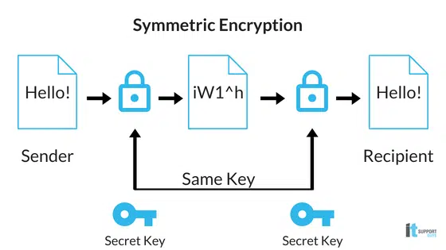
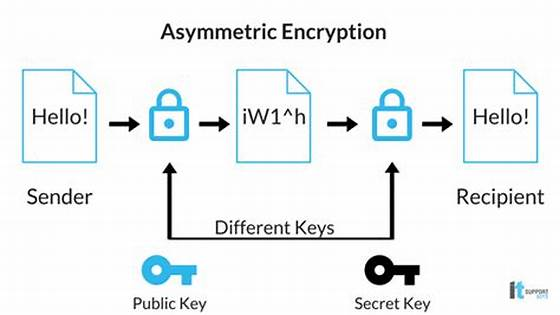
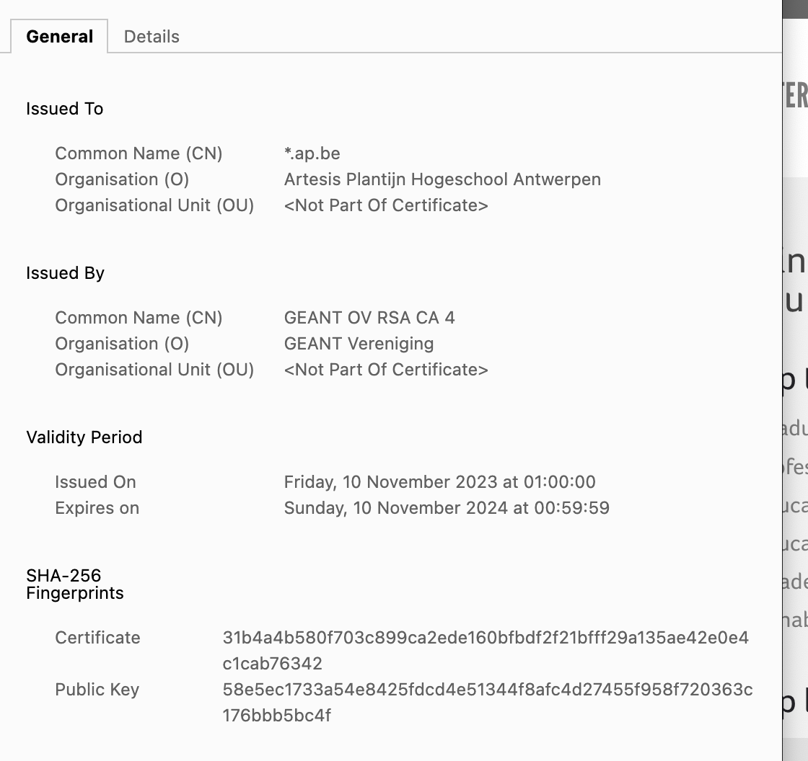
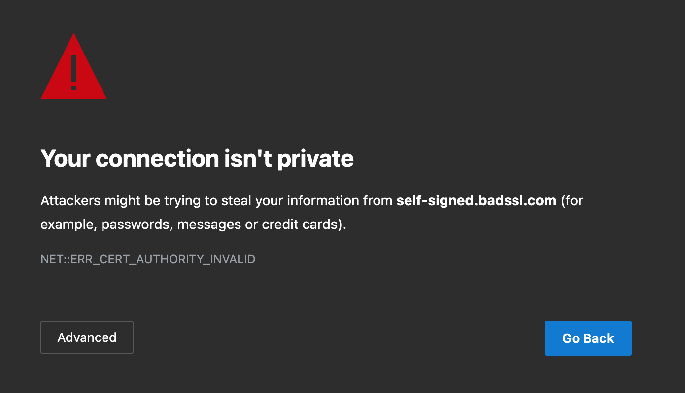

# Hashing & Encryptie

## Hashing

Hashing is een techniek die gebruikt wordt om data onleesbaar te maken. Het is een eenzijdige functie, wat betekent dat je de originele data niet kan herstellen uit de hash. Het is een veelgebruikte techniek om wachtwoorden te beveiligen.

Bcrypt is een populaire library om wachtwoorden te hashen. Het is een implementatie van het Blowfish algoritme en is ontworpen om langzaam te zijn, zodat het moeilijk is om wachtwoorden te kraken.

### Installeren

Om Bcrypt te gebruiken in je Node.js project, moet je de library eerst installeren via npm:

```bash
npm install bcrypt
npm install --save-dev @types/bcrypt
```

### Hash functie

Alle bcrypt functies hebben een asynchrone en een synchrone (blokkerende) variant. Omdat hashing een intensieve taak is, is het aan te raden om de asynchrone variant te gebruiken want deze is geschikt voor asynchrone omgevingen zoals Node.js. Er is een versie met promises en een versie met callbacks. Wij verkiezen die met promises met gebruik van `async` en `await`.

Je kan op de volgende manier een wachtwoord hashen:

```typescript
import bcrypt from 'bcrypt';

const saltRounds : number = 10;

async function main() : Promise<string> {
    let hashedPassword : string =  await bcrypt.hash("hunter2", saltRounds);
    console.log(hashedPassword);
}
main();
```

Als je dit uitvoert zal je een hash zien die er ongeveer zo uitziet: `$2b$10$UVVA3Gy.0iDmSXTZQfwu8.n96QCw.GkjfTYfb0GcTzM/N0KxsPg8S`

Je merkt op dat we hier een saltRounds variabele gebruiken. Voorlopig mag je altijd 10 gebruiken, we zullen later uitleggen wat dit betekent.

### Vergelijken

Als je twee keer een wachtwoord hash, zal je twee verschillende hashes krijgen. Hier zijn bepaalde redenen voor, maar het belangrijkste dat je moet weten is dat je niet het volgende kan doen:

```typescript
let hashedPassword1 : string = await bcrypt.hash("hunter2", saltRounds);
let hashedPassword2 : string = await bcrypt.hash("hunter2", saltRounds);

console.log(hashedPassword1 === hashedPassword2); // false
```

Hiervoor moet je de `compare` functie gebruiken:

```typescript
import bcrypt from 'bcrypt';

const saltRounds : number = 10;

async function main() : Promise<boolean> {
    let hashedPassword : string =  await bcrypt.hash("hunter2", saltRounds);
    let isSame : boolean = await bcrypt.compare("hunter2", hashedPassword);
    console.log(isSame); // true
}
main();
```

Hier moet je geen `saltRounds` meegeven, omdat de salt in de hash zit en automatisch wordt gebruikt.

### Security overwegingen

#### Salt

Een salt is een willekeurige waarde die wordt toegevoegd aan de data voordat het gehasht wordt. Dit zorgt ervoor dat twee keer dezelfde data een andere hash zal opleveren. Dit is belangrijk omdat het voorkomt dat een aanvaller een rainbow table kan gebruiken om wachtwoorden te kraken. Een rainbow table is een tabel met hashes van veelgebruikte wachtwoorden. Als je geen salt gebruikt, kan een aanvaller de hash van een wachtwoord opzoeken in de tabel en zo het wachtwoord achterhalen. Bcrypt voegt automatisch een salt toe aan de hash, dit is waarom je je dus nooit geen twee keer dezelfde hash zal krijgen, zelfs voor de zelfde data.

#### SaltRounds

De `saltRounds` parameter bepaalt hoeveel werk bcrypt moet doen om een hash te berekenen. Hoe hoger het getal, hoe langer het duurt om een hash te berekenen. Dit is belangrijk omdat het het moeilijker maakt voor een aanvaller om wachtwoorden te kraken. Als je een te laag getal gebruikt, kan een aanvaller met een krachtige computer veel wachtwoorden per seconde kraken. Als je een te hoog getal gebruikt, kan het te lang duren om een hash te berekenen. Dit maakt het bijna onmogelijk om binnen redelijke tijd voor alle combinaties van wachtwoorden een hash te berekenen. Een goede waarde voor `saltRounds` is 10. Let er op dat je deze waarde nooit te hoog zet, want dit zal het voor de hacker moeilijker maken om wachtwoorden te kraken, maar ook voor jezelf om wachtwoorden te hashen. Dus dit heeft een impact op de performantie van je applicatie.

Probeer maar eens zelf een wachtwoord te hashen met een `saltRounds` van 20 en 5. Je zal merken dat het met 20 veel langer duurt dan met 5.

#### Timing attacks

Timing attacks zijn aanvallen waarbij een aanvaller probeert om informatie te verkrijgen door de tijd te meten die het kost om een bepaalde taak uit te voeren. Dit kan bijvoorbeeld gebruikt worden om een wachtwoord te kraken door te meten hoe lang het duurt om een hash te berekenen. Bcrypt is ontworpen om dit soort aanvallen te voorkomen door een vaste tijd te nemen om een hash te berekenen, ongeacht de input. Dit voorkomt dat een aanvaller informatie kan verkrijgen door de tijd te meten. Bv: als je een lang wachtwoord hebt, zal het niet langer duren om een hash te berekenen dan voor een kort wachtwoord.

### Gebruik van hashing voor bestanden

Je kan hashing ook gebruiken om de integriteit van bestanden te controleren. Als je een hash berekent van een bestand en deze hash bewaart, kan je later controleren of het bestand is gewijzigd. Als de hash van het bestand overeenkomt met de bewaarde hash, weet je dat het bestand niet is gewijzigd. Als de hash niet overeenkomt, weet je dat het bestand is gewijzigd en kan je actie ondernemen.

Vaak zie je op een website iets zoals dit:


Als je het bestand gedownload hebt kan je met het `sha256sum` in je console de hash berekenen en controleren of deze overeenkomt met de hash op de website.

```bash
sha256sum vscode-windows-x64.zip
```

of in Windows:

```powershell
Get-FileHash vscode-windows-x64.zip -Algorithm SHA256
```

Als de hashes overeenkomen, weet je dat het bestand niet is gewijzigd en dat je het veilig kan gebruiken.

## Encryptie

Encryptie is een techniek die gebruikt wordt om data te versleutelen. Het grote verschil met hashing is dat je de originele data kan herstellen uit de versleutelde data. Dit doe je aan de hand van een sleutel (een soort passwoord). Encryptie wordt vaak gebruikt om data te beveiligen tijdens transport (zoals gebeurd bij HTTPS) of om data te beveiligen op een harde schijf. 

Er zijn twee soorten encryptie: symmetrische en asymmetrische encryptie.

### Symmetrische encryptie

Bij symmetrische encryptie wordt dezelfde sleutel gebruikt om data te versleutelen en te ontsleutelen. Dit betekent dat de sleutel geheim moet blijven, anders kan iedereen de data ontsleutelen. Symmetrische encryptie is snel en efficiënt, maar heeft als nadeel dat je de sleutel veilig moet kunnen uitwisselen. Beide partijen moeten de sleutel kennen om data te kunnen uitwisselen.



Het grote nadeel van symmetrische encryptie is dat je de sleutel veilig moet kunnen uitwisselen. Als je de sleutel via een onveilig kanaal verstuurt, kan een aanvaller de sleutel onderscheppen en zo toegang krijgen tot de data. 

### Asymmetrische encryptie (Public Key Cryptography)

Bij asymmetrische encryptie worden twee sleutels gebruikt: een publieke en een private sleutel. De publieke sleutel wordt gebruikt om data te versleutelen en de private sleutel wordt gebruikt om data te ontsleutelen. Dit betekent dat je de publieke sleutel veilig kan delen met anderen, zonder dat ze toegang hebben tot de private sleutel. Assymetrische encryptie is veiliger omdat er geen geheimen gedeeld moeten worden, maar is ook trager en minder efficiënt dan symmetrische encryptie. 



Pas op dat je nooit een private sleutel deelt met anderen, want dan kan iedereen je data ontsleutelen.

### HTTPS

#### Wat is HTTPS?

HTTPS zorgt voor een beveiligde communicatie tussen een webserver en een browser. Het maakt gebruik van symmetrische en asymmetrische encryptie om data over de lijn te beveiligen. Zo weet je zeker dat er niemand meeluistert of je data kan onderscheppen.

Als je een website bezoekt via HTTPS, kan je zien dat de URL begint met `https://` en dat er een slotje in de adresbalk staat. Dit betekent dat de verbinding beveiligd is en dat je data veilig is. Let er altijd op dat je een website bezoekt via HTTPS als je gevoelige data moet invoeren, zoals wachtwoorden of creditcardgegevens.


Het is wel belangrijk om te weten dat je er niet automatisch vanuit mag gaan dat een website veilig is als het begint met `https://`. Het betekent enkel dat de verbinding beveiligd is, maar niet dat de website zelf veilig is. Een website kan nog steeds kwetsbaar zijn voor aanvallen zoals cross-site scripting of SQL injection.

#### Wat is een SSL certificaat?

Een SSL certificaat is een digitaal certificaat dat wordt gebruikt om de identiteit van een website te verifiëren en om een beveiligde verbinding tot stand te brengen. Het certificaat bevat informatie over de website, zoals de naam van de eigenaar en de geldigheidsduur van het certificaat. Het bevat ook de publieke sleutel van de website, die wordt gebruikt om data te versleutelen.



Je moet hier wel mee opletten want in principe kan iedereen een SSL certificaat zelf aanmaken. Dit betekent dat een website die begint met `https://` niet per se veilig is. Hier komt de rol van certificeringsinstanties (CA's) in het spel. Als je een website bezoekt via HTTPS, controleert je browser of het SSL certificaat geldig is en of het is uitgegeven door een vertrouwde CA. Als dit niet het geval is, krijg je een waarschuwing te zien en kan je beslissen of je de website wil bezoeken of niet.



#### Let's Encrypt

Normaal gezien moet je betalen voor een SSL certificaat, maar er zijn ook gratis alternatieven beschikbaar.

Let's Encrypt is een non-profit certificeringsinstantie (CA's) die gratis SSL certificaten uitgeeft. Het doel van Let's Encrypt is om het internet veiliger te maken door het gebruik van HTTPS te stimuleren. Je kan een SSL certificaat aanvragen via de website van Let's Encrypt of via een hosting provider die Let's Encrypt ondersteunt.

Je kan meer informatie vinden op de website van Let's Encrypt: [https://letsencrypt.org/](https://letsencrypt.org/)

