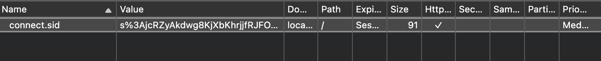

# Sessions

Sessions zijn een manier om data te bewaren tussen verschillende requests. Eigenlijk doet het vrijwel hetzelfde als cookies, maar zonder dat de data op de client wordt opgeslagen. In plaats daarvan wordt er een unieke identifier naar de client gestuurd, waarmee de server de data kan ophalen. Deze identifier wordt in een cookie opgeslagen in de browser, maar de data zelf wordt op de server bewaard. Dit maakt het veiliger dan cookies, omdat de data niet kan worden aangepast door de client. Daarom dat sessies wel gepast zijn voor gebruik in een login-systeem.

## Sessions in Express

In Express kan je gebruik maken van de `express-session` package om sessies te gebruiken. Deze package zorgt ervoor dat er een sessie wordt aangemaakt voor elke client die de server bezoekt. Je kan deze package installeren met npm:

```bash
npm install express-session
npm install --save-dev @types/express-session
```

Het is aan te raden om alles van de sessie in een aparte file te zetten, zodat je het makkelijk kan importeren in je Express applicatie. Maak een nieuw bestand aan, bijvoorbeeld `session.ts`, en zet daar de volgende code in:

```typescript
import dotenv from "dotenv";
dotenv.config();

import session, { MemoryStore } from "express-session";

declare module 'express-session' {
    export interface SessionData {
        // All session properties should be defined here
    }
}

export default session({
    secret: process.env.SESSION_SECRET ?? "my-super-secret-secret",
    store: new MemoryStore(),
    resave: true,
    saveUninitialized: true,
    cookie: {
        maxAge: 1000 * 60 * 60 * 24 * 7, // 1 week
    }
});
```

- De `secret` optie is een string die wordt gebruikt om de sessie te beveiligen. Het is belangrijk dat deze string geheim blijft, omdat het wordt gebruikt om de sessie te versleutelen. Als iemand deze string weet, kan hij de sessie van een andere gebruiker overnemen. Daarom is het een goed idee om deze string in een environment variabele te zetten, zodat deze niet in de code staat.
- De `store` optie is een object dat de sessie data opslaat. In dit geval gebruiken we een `MemoryStore`, wat betekent dat de data in het geheugen van de server wordt opgeslagen. Dit is handig voor ontwikkeling en debugging, maar niet geschikt voor productie. In productie gebruik je best een externe database, zoals MongoDB of Redis.
- De `resave` optie bepaalt of de sessie opnieuw moet worden opgeslagen als er geen veranderingen zijn. De standaardwaarde is `true`.
- De `saveUninitialized` optie bepaalt of de sessie moet worden opgeslagen als er geen data in zit. De standaardwaarde is `true`.
- De `maxAge` optie bepaalt hoelang de sessie geldig is. In dit geval is de sessie 1 week geldig. Als je deze optie niet instelt, is de sessie geldig tot de browser wordt gesloten.

Vervolgens moeten we deze sessie middleware toevoegen aan onze Express applicatie. Eerst importeren we de sessie middleware in ons `app.ts` bestand:

```typescript
import session from "./session";
```

en dan voegen we onze eigen session middleware toe aan de Express applicatie:

```typescript
app.use(session);
```

Als je nu je express server opstart en een request doet naar eender welke route, zal er een sessie worden aangemaakt voor de client. Je kan dit zien in de developer tools van je browser, waar je een cookie ziet met de naam `connect.sid`. Deze cookie bevat de identifier van de sessie en zal worden gebruikt om de sessie te identificeren op de server. Deze wordt automatisch meegestuurd vanuit de browser bij elke request.



### Session data opslaan/uitlezen

Vooraleer we data kunnen opslaan in een sessie moeten we definieren wat we willen opslaan. Als we bijvoorbeeld "username" willen bijhouden in de sessie, moeten we in ons `session.ts` bestand de volgende code aanpassen:

```typescript
declare module 'express-session' {
    export interface SessionData {
        username?: string;
    }
}
```

Het voordeel van een sessie t.o.v. een cookie is hier dat je ook complexe objecten kan opslaan in de sessie, zoals arrays of objecten. Dus je hoeft deze niet te serialiseren naar een string.

Vervolgens kunnen we data opslaan in de sessie door de `req.session` object te gebruiken:

```typescript
req.session.username = "JohnDoe";
```

Om de sessie data uit te lezen kunnen we hetzelfde object gebruiken:

```typescript
const username = req.session.username;
console.log(username);
```

### Sessie data verwijderen

Om data uit de sessie te verwijderen, kan je de property verwijderen uit het `req.session` object:

```typescript
req.session.destroy(() => {
    console.log("Sessie verwijderd");
});
```

### Session stores

De inhoud van de sessie wordt langs de serverzijde opgeslagen. Dit impliceert dat, met bovenstaande code, sessies geen herstart van de server kunnen overleven, want er is nergens een opslagmechanisme vermeld.

Het defaultmechanisme van express-session is een "in-memory store", dus tijdelijke opslag. Voor ontwikkeling en debugging kan dit handig zijn. In productie gebruik je een "session store". Dit is een externe database die de sessiegegevens opslaat. Er zijn verschillende session stores beschikbaar, zoals `connect-redis`, `connect-mongo`, `connect-mysql`, enz. Deze moet je zelf installeren en configureren.

Wil je bijvoorbeeld mongodb gebruiken als session store, dan installeer je de package `connect-mongodb-session`:

```bash
npm install connect-mongodb-session
npm install --save-dev @types/connect-mongodb-session
```

Wil je deze gebruiken, dan moet je de `MemoryStore` vervangen door de `MongoDBStore`:

```typescript
import dotenv from "dotenv";
dotenv.config();

import session from "express-session";
import mongoDbSession from "connect-mongodb-session";
const MongoDBStore = mongoDbSession(session);

const mongoStore = new MongoDBStore({
    uri: process.env.MONGODB_URI ?? "mongodb://localhost:27017",
    collection: "sessions",
    databaseName: "webontwikkeling",
});

mongoStore.on("error", (error) => {
    console.error(error);
});

declare module 'express-session' {
    export interface SessionData {
        username?: string;
    }
}

export default session({
    secret: process.env.SESSION_SECRET ?? "my-super-secret-secret",
    store: mongoStore,
    resave: false,
    saveUninitialized: false,
});
```

### Voorbeelden

#### Winkel karretje

Willen we nu het winkelkarretje van een gebruiker bijhouden op de server in plaats van in de browser, dan kunnen we dit doen met sessies. We kunnen in een sessie een array bijhouden van producten die de gebruiker heeft toegevoegd aan zijn winkelkarretje. Deze keer zullen we geen array van strings bijhouden, maar een array van objecten. Elk object zal een product voorstellen, met een naam en een prijs.

Het eerste wat we moeten doen is het product definiëren in een interface (bv in `types.ts`):

```typescript
interface Product {
    name: string;
    price: number;
}
```

In het `session.ts` bestand moeten we deze interface importeren en toevoegen aan de `SessionData` interface:

```typescript
declare module 'express-session' {
    export interface SessionData {
        cart?: Product[];
    }
}
```

De rest van de code in `session.ts` blijft hetzelfde. Vergeet deze niet te importeren en toe te voegen aan de Express applicatie in `index.ts`.

In het `index.ts` bestand definieren we nu een array van producten die we later kunnen toevoegen aan ons winkelkarretje:

```typescript
let items: Product[] = [
    {name: "Apple", price: 1},
    {name: "Banana", price: 2},
    {name: "Cherry", price: 3},
    {name: "Orange", price: 2},
    {name: "Raspberry", price: 4},
    {name: "Strawberry", price: 1},
    {name: "Watermelon", price: 5},
];
```

De code om dan een product toe te voegen aan het winkelkarretje ziet er als volgt uit:

```typescript
app.get("/cart", (req, res) => {
    let add : string = typeof req.query.add === "string" ? req.query.add : "";
    let cart: Product[] = req.session.cart ? req.session.cart : [];
    let addProduct : Product | undefined = items.find(product => product.name === add);
    if (addProduct) {
        if (add) {
            cart.push(addProduct);
            req.session.cart = cart;
        }
    }

    res.render("cart", {
        items: items,
        cart: cart
    })
});
```
