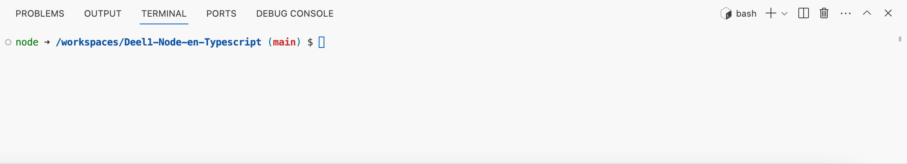
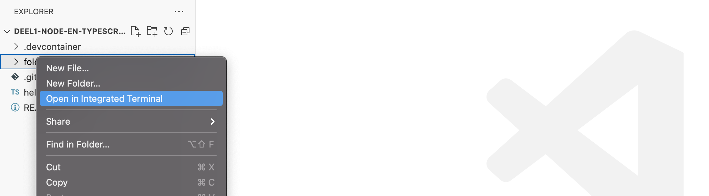
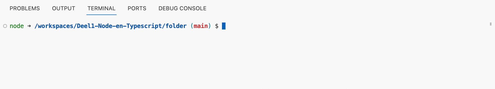
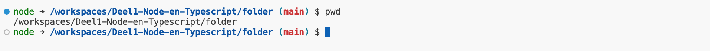
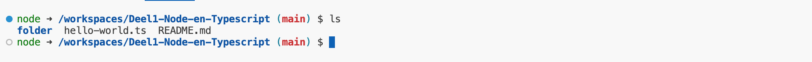
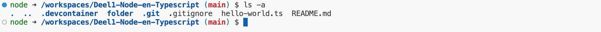

# Terminal en Bash

## Bash

Bash, een afkorting voor Bourne Again SHell, is een veelgebruikte command-line interface (CLI) of terminal op Linux en Unix-achtige besturingssystemen. Devcontainers gebruiken standaard een bash shell.

## Terminal

### Open een terminal

Om een nieuwe terminal te openen in visual studio code klik je op `Terminal` in de menubalk en vervolgens op `New Terminal`. Dit opent een nieuwe terminal in de onderkant van je scherm. 



Merk op dat je zelfs al werk je in windows je een bash terminal krijgt en nergens iets van een C schijf of dergelijke ziet. Dit komt omdat je in een devcontainer werkt. 

Even de structuur van de terminal uitleggen. De prompt is het stukje tekst dat je ziet voor je cursor. In de afbeelding hierboven is dat `node ➜ /workspaces/Deel1-Node-en-Typescript (main)`:
- `node` is de naam van de gebruiker. Dit is standaard in een nodejs devcontainer, je mag dit negeren.
- `➜` is een pijltje dat je mag negeren.
- `/workspaces/Deel1-Node-en-Typescript` is de huidige map waarin je zit. Dit is de map waarin je terminal opent. 
- `(main)` is de naam van de branch waarin je zit in de git repository.
- `$` is de prompt zelf. Dit is een teken dat je commando's kan beginnen typen.
- De cursor is het knipperende streepje dat aangeeft waar je tekst zal verschijnen als je begint te typen.

### Open in Integrated Terminal

Je kan ook een terminal openen in een specifieke map door eerst naar de map te navigeren in de file explorer en dan rechts te klikken en te kiezen voor `Open in Integrated Terminal`.



Omdat we hier de terminal openen in de `folder` directory, zal de terminal ook openen in die map.



## Basis commando's

We gaan hier de basis commando's behandelen die nodig zijn om te navigeren in een mappen structuur. Er zijn nog veel andere commando's die je gaandeweg zal leren, maar deze zijn voldoende om te starten.

### pwd

`pwd` staat voor `print working directory`. Dit commando toont de huidige map waarin je zit.



Je ziet dat we in de map `/workspaces/Deel1-Node-en-Typescript` zitten. Dat wist je al omdat je dat ook in de prompt zag.

### ls  

`ls` staat voor `list`. Dit commando toont de bestanden en mappen in de huidige map.



Je kan ook de `ls -a` gebruiken om ook verborgen bestanden en mappen te tonen. Dit zijn bestanden en mappen die beginnen met een punt.



Let er op dat de bestanden `.` en `..` altijd getoond worden. `.` staat voor de huidige map en `..` staat voor de bovenliggende map.


### cd

`cd` staat voor `change directory`. Dit commando laat je toe om naar een andere map te gaan.

Stel je voor dat je een mappen structuur hebt zoals deze:

```
workspaces
└── Deel1-Node-en-Typescript
    ├── node_modules
    ├── src
    │   ├── dir1
    │   │   └── file1.ts
    └── tooling
```

By default zit je in de map `Deel1-Node-en-Typescript`. Als je naar de map `src` wil gaan, dan typ je `cd src`.

Wil je terug naar de map `Deel1-Node-en-Typescript`, dan typ je `cd ..`. Dit commando staat voor `ga naar de bovenliggende map`. Je kan ook twee

Je kan ook rechstreeks van de ene map naar de andere gaan. Als je in de map `Deel1-Node-en-Typescript` zit en je wil naar de map `dir1`, dan typ je `cd src/dir1`.

## Tab completion

Tab completion werkt ook in de terminal. Als je begint te typen en dan op tab drukt, dan zal de terminal proberen aan te vullen wat je aan het typen bent. Als er meerdere mogelijkheden zijn, dan zal de terminal een lijst tonen van mogelijke aanvullingen.

## mkdir

`mkdir` staat voor `make directory`. Dit commando laat je toe om een nieuwe map aan te maken.

Stel dat je in de map `Deel1-Node-en-Typescript` zit en je wil een nieuwe map `labos` aanmaken, dan typ je `mkdir labos`.

## touch

`touch` is een commando dat je toelaat om een nieuw bestand aan te maken. Als je in de map `Deel1-Node-en-Typescript` zit en je wil een nieuw bestand `index.html` aanmaken, dan typ je `touch index.html`.

## cp

`cp` staat voor `copy`. Dit commando laat je toe om een bestand of map te kopiëren. Als je een bestand `index.html` wil kopiëren naar `index2.html`, dan typ je `cp index.html index2.html`.

Je kan ook een map kopiëren. Als je een map `src` wil kopiëren naar `src2`, dan typ je `cp -r src src2`. De `-r` staat voor `recursive` en zorgt ervoor dat de map en alle bestanden en mappen in de map gekopieerd worden.

## mv

`mv` staat voor `move`. Dit commando laat je toe om een bestand of map te verplaatsen. Als je een bestand `index.html` wil verplaatsen naar de map `src`, dan typ je `mv index.html src`.

Je kan ook een bestand hernoemen. Als je een bestand `index.html` wil hernoemen naar `index2.html`, dan typ je `mv index.html index2.html`.